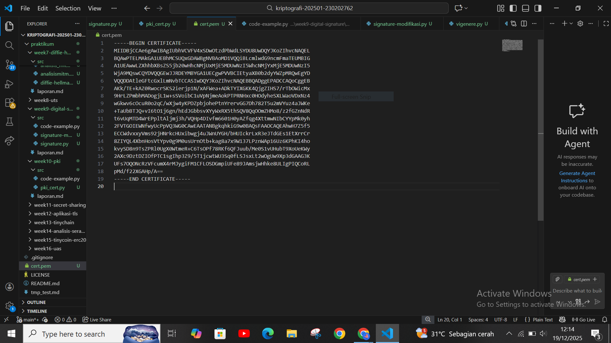

# Laporan Praktikum Kriptografi
Minggu ke-: 10 

Topik: Public Key Infrastructure (PKI & Certificate Authority)  

Nama: Khusnatun Lina Fitri

NIM: 230202762  

Kelas:5IKRB 

---

## 1. Tujuan
1. Membuat sertifikat digital sederhana.  
2. Menjelaskan peran Certificate Authority (CA) dalam sistem PKI.  
3. Mengevaluasi fungsi PKI dalam komunikasi aman (contoh: HTTPS, TLS).  

---

## 2. Dasar Teori

Public Key Infrastructure (PKI) merupakan sebuah kerangka kerja kriptografi yang penting dalam keamanan digital karena memungkinkan pengelolaan sertifikat digital dan pasangan kunci publik–privat untuk keperluan autentikasi, enkripsi, dan integritas data dalam komunikasi jaringan. Dalam PKI, sertifikat digital mengikuti standar seperti X.509 yang mengikat identitas suatu entitas dengan kunci publiknya melalui tanda tangan digital dan diverifikasi oleh pihak tepercaya agar dapat dipercaya oleh pengguna lain dalam sistem komunikasi. Standar X.509 sendiri menjadi dasar dalam berbagai protokol aman termasuk TLS/SSL yang digunakan dalam HTTPS. 

Peran Certificate Authority (CA) dalam sistem PKI sangat sentral karena CA bertanggung jawab untuk memverifikasi identitas pemohon sertifikat sebelum menerbitkan sertifikat digital yang valid. Dalam hierarki PKI yang umum, root CA berada pada tingkat tertinggi sebagai sumber kepercayaan utama, dan dapat mendelegasikan tugas penerbitan ke intermediate CA untuk meningkatkan keamanan operasional dan skalabilitas sistem. Hal ini membantu memastikan bahwa sertifikat yang diterbitkan benar-benar berasal dari sumber tepercaya.

Fungsi sistem PKI juga terlihat jelas dalam konteks komunikasi aman seperti HTTPS dan protokol TLS, di mana sertifikat digital yang diterbitkan oleh CA memungkinkan browser dan server untuk melakukan handshake yang terenkripsi dan saling memverifikasi identitas masing-masing pihak. Dengan demikian, data yang ditransmisikan terlindungi dari penyadapan atau modifikasi oleh pihak yang tidak berwenang, sehingga menjaga kerahasiaan dan keutuhan informasi. 

---

## 3. Alat dan Bahan
- Python 3.x  
- Visual Studio Code / editor lain  
- Git dan akun GitHub  
- Google Schollar 

---

## 4. Langkah Percobaan

1. Membuat file `pki_cert.py` di folder `praktikum/week10-pki/src/`.
2. Menyalin kode program dari panduan praktikum.
3. Menjalankan program dengan perintah `python pki_cert.py`.)
4. Membuat file `hasil-p10.PNG' di folder `praktikum/week10-pki/screenshots/`.
5. Menjawab pertanyaan diskusi.
6. Menyelesaikan laporan.md

---

## 5. Source Code

Code python dengan file `pki_cert.py`
```
from cryptography import x509
from cryptography.x509.oid import NameOID
from cryptography.hazmat.primitives import hashes, serialization
from cryptography.hazmat.primitives.asymmetric import rsa
from datetime import datetime, timedelta, timezone

# Generate key pair
key = rsa.generate_private_key(
    public_exponent=65537,
    key_size=2048
)

# Subject & issuer (self-signed CA sederhana)
subject = issuer = x509.Name([
    x509.NameAttribute(NameOID.COUNTRY_NAME, u"ID"),
    x509.NameAttribute(NameOID.ORGANIZATION_NAME, u"UPB Kriptografi"),
    x509.NameAttribute(NameOID.COMMON_NAME, u"example.com"),
])

# Buat sertifikat
cert = (
    x509.CertificateBuilder()
    .subject_name(subject)
    .issuer_name(issuer)
    .public_key(key.public_key())
    .serial_number(x509.random_serial_number())
    .not_valid_before(datetime.now(timezone.utc))
    .not_valid_after(datetime.now(timezone.utc) + timedelta(days=365))
    .sign(key, hashes.SHA256())
)

# Simpan sertifikat
with open("cert.pem", "wb") as f:
    f.write(cert.public_bytes(serialization.Encoding.PEM))

print("Sertifikat digital berhasil dibuat: cert.pem")

```
---

## 6. Hasil dan Pembahasan

Hasil eksekusi program pki_cert.py



Pada code program sedikit saya rubah untuk bagian waktu validasi sertifikat yaitu pada bagian `datetime.utcnow()` menjadi `datetime.now(timezone.utc)` agar sesuai dengan standar Python saya. 

Setelah program berhasil dieksekusi dan berhasil tahap selanjutnya yaitu memverifikasi sertifikat digital yang telah dibuat dengan memanfaatkan public key untuk memeriksa tanda tangan digital pada sertifikat. Karena sertifikat bersifat self-signed, maka proses verifikasi menggunakan pasangan kunci yang sama dengan kunci penandatangan. Verifikasi ini bertujuan untuk memastikan bahwa sertifikat benar-benar asli dan tidak mengalami perubahan sejak ditandatangani.

Dalam sistem PKI yang sebenarnya, proses verifikasi diperkuat oleh Certificate Authority (CA) sebagai pihak tepercaya. CA menjamin keaslian sertifikat dengan menandatanganinya menggunakan private key CA, sehingga pengguna cukup memverifikasi sertifikat menggunakan public key CA yang telah dipercaya sebelumnya.

Selain CA yang digunakan untuk memverifikasi keaslian sertifikat, browser juga bisa memverifkasi sertifikat secara otomatis seperti pada pengaksesan situs HTTPS. Jadi, ketika pengguna mengakses sebuah website, browser akan melakukan pemeriksaan terhadap sertifikat digital yang diterima, seperti validitas tanda tangan digital, masa berlaku sertifikat, serta kesesuaian nama domain yang tercantum di dalam sertifikat. Proses ini dilakukan dengan membandingkan sertifikat tersebut dengan daftar Certificate Authority yang telah tersimpan di dalam browser atau sistem operasi.

Apabila seluruh proses verifikasi berhasil, browser akan melanjutkan komunikasi menggunakan protokol TLS dengan koneksi yang terenkripsi sehingga data yang dikirimkan aman dari penyadapan. Namun, jika sertifikat tidak valid atau diterbitkan oleh CA yang tidak tepercaya, browser akan menampilkan peringatan keamanan kepada pengguna. Dengan mekanisme ini, Public Key Infrastructure (PKI) berperan penting dalam mencegah serangan Man-in-the-Middle dan menjaga keamanan komunikasi pada layanan berbasis HTTPS.

---

## 7. Jawaban Pertanyaan

1. Apa fungsi utama Certificate Authority (CA)?  
2. Mengapa self-signed certificate tidak cukup untuk sistem produksi?  
3. Bagaimana PKI mencegah serangan MITM dalam komunikasi TLS/HTTPS?  

Jawaban : 

1. Fungsi utama Certificate Authority (CA) adalah sebagai lembaga tepercaya yang berperan dalam menjamin keaslian identitas suatu entitas di dalam sistem keamanan berbasis PKI. CA bertugas melakukan proses verifikasi identitas sebelum menerbitkan sertifikat digital, sehingga kunci publik yang tercantum di dalam sertifikat benar-benar dimiliki oleh pihak yang bersangkutan. Selain menerbitkan sertifikat, CA juga mengelola masa berlaku sertifikat, melakukan pembaruan, serta menyediakan mekanisme pencabutan sertifikat apabila terjadi penyalahgunaan atau kebocoran kunci. Dengan adanya CA, kepercayaan antar pihak dalam komunikasi digital dapat terbangun tanpa harus saling mengenal secara langsung.

2. Self-signed certificate tidak cukup digunakan pada sistem produksi karena sertifikat jenis ini diterbitkan dan ditandatangani oleh pemiliknya sendiri tanpa melibatkan pihak ketiga yang tepercaya. Akibatnya, klien atau browser tidak memiliki dasar untuk memastikan bahwa identitas server tersebut benar dan bukan tiruan. Hal ini biasanya ditandai dengan munculnya peringatan keamanan pada browser, yang dapat menurunkan kepercayaan pengguna terhadap sistem. Selain itu, penggunaan self-signed certificate meningkatkan risiko serangan seperti penyamaran identitas (spoofing), sehingga sertifikat ini lebih cocok digunakan pada tahap pengembangan, pengujian, atau pembelajaran, bukan pada lingkungan produksi yang melibatkan pengguna umum.

3. PKI mencegah serangan Man-in-the-Middle (MITM) dalam komunikasi TLS/HTTPS melalui mekanisme verifikasi sertifikat dan enkripsi komunikasi. Ketika klien mengakses sebuah server HTTPS, klien akan memeriksa sertifikat digital server tersebut, termasuk keabsahan tanda tangan CA, kesesuaian nama domain, dan masa berlaku sertifikat. Jika sertifikat dinyatakan valid, proses handshake TLS akan dilanjutkan untuk membentuk kunci sesi yang digunakan dalam enkripsi data. Dengan cara ini, pihak ketiga yang mencoba menyadap atau memodifikasi komunikasi tidak dapat membaca isi data karena terenkripsi, serta tidak dapat menyamar sebagai server yang sah karena tidak memiliki sertifikat valid yang diterbitkan oleh CA tepercaya.

---

## 8. Kesimpulan

Setelah mengerjakan praktikum, saya jadi dapat memahami bagaimana konsep dasar Public Key Infrastruktur (PKI) dan bagaimana penerapannya seperti penggunaan CA untuk memverifikasi keaslian sertifikat dan bagaimana cara browser untuk memverifikasi keaslian sertifikat dalam komunikasi HTTPS. Selain itu saya juga berhasil membuat sertifikat digital `self-signed` dengan penggunaan public key dan privat key. Dengan demikian PKI membantu melindungi data dari ancaman keamanan seperti serangan MITM. 

---

## 9. Daftar Pustaka

- Wathoni, M., Nurhasanah, R., Shela, D., Informasi, P. T., Pendidikan, F. I., Muhammadiyah, U., & Selatan, K. T. (n.d.). Penerapan konfigurasi dasar pki dua tingkat: active directory certificate services (ad cs). 55–62.

---

## 10. Commit Log

```
commit week10-pki
Author: Khusnatun Lina Fitri <husnatunlinafitri@gmail.com>
Date:   2025-12-13

   week10-pki : Public Key Infrastructure (PKI & Certificate Authority)

```
