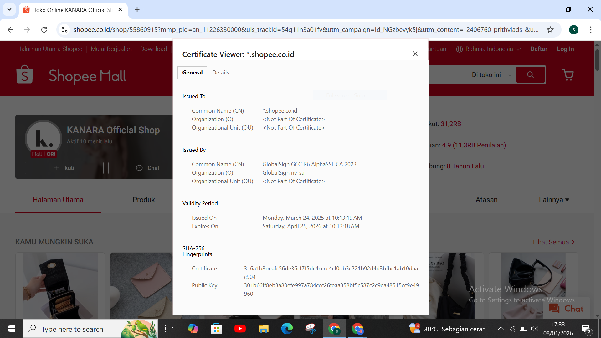

# Laporan Praktikum Kriptografi
Minggu ke-: 12

Topik:Aplikasi TLS & E-commerce

Nama: Khusnatun Lina Fitri

NIM: 230202762

Kelas: 5IKRB

---

## 1. Tujuan
1. Menganalisis penggunaan kriptografi pada **email** dan **SSL/TLS**.  
2. Menjelaskan enkripsi dalam transaksi **e-commerce**.  
3. Mengevaluasi isu **etika & privasi** dalam penggunaan kriptografi di kehidupan sehari-hari.  


---

## 2. Dasar Teori

Transport Layer Security (TLS) adalah protokol keamanan yang digunakan untuk melindungi data yang dikirimkan melalui jaringan internet. Protokol ini berfungsi untuk menjaga kerahasiaan dan keutuhan data dengan cara melakukan proses enkripsi antara pengguna dan server. Melalui mekanisme handshake dan penggunaan sertifikat digital, TLS memastikan bahwa komunikasi yang terjadi berlangsung secara aman sehingga data sensitif tidak mudah diakses oleh pihak yang tidak berwenang.

E-commerce merupakan kegiatan transaksi jual beli barang atau jasa yang dilakukan secara elektronik dengan memanfaatkan jaringan internet. Dalam sistem e-commerce, keamanan data menjadi hal yang sangat penting karena proses transaksi melibatkan informasi pribadi dan data pembayaran pengguna. Oleh karena itu, penerapan TLS pada aplikasi e-commerce diperlukan untuk melindungi data dari berbagai ancaman, seperti penyadapan data dan manipulasi informasi selama proses transaksi berlangsung.

Penggunaan TLS pada aplikasi e-commerce dapat meningkatkan tingkat keamanan serta kepercayaan pengguna terhadap layanan yang disediakan. Dengan adanya sistem keamanan yang baik, pengguna akan merasa lebih aman dalam melakukan transaksi secara online. Hal ini memberikan dampak positif bagi pengembangan dan keberlanjutan bisnis e-commerce karena keamanan informasi menjadi salah satu faktor utama dalam keberhasilan sistem perdagangan elektronik.

---

## 3. Alat dan Bahan

- Python 3.11
- Visual Studio Code 
- Git dan akun GitHub  
- Google Chrome
---

## 4. Langkah Percobaan

### Langkah 1 - Analisis SSL/TLS pada Email & Web (Shopee)

Berdasarkan hasil pengecekan setifikat SSL/TLS pada website Shopee menggunkaan browser, diperoleh informasi bahwa website shopee telah menggunkan protokol HTTPS ynag mennadakan adanya enkripsi data. 

- Issuer CA (Certificate Authority) : Sertifikat digital website Shopee diterbitkan oleh **GlobalSign GCC R6 AlphaSSL CA 2023** , yang merupakan Certificate Authority terpercaya.
  
-  Sertifikat tersebut memiliki masa berlaku mulai **24 Maret 2025** sampai **25 April 2026**, sehingga masih aktif dan dapat digunakan.

- Website Shopee juga menerapkan algoritma enkripsi yang aman dengan menggunakan **RSA** untuk proses pertukaran kunci dan **AES** untuk mengenkripsi data selama komunikasi berlangusng.
  
- Perbedaan yang jelas antara website HTTPS dan non-HTTPS terletak pada keamanannnya, dimana HTTPS mampu mengenkripsi data pengguna, sedangkan website tanpa HTTPS sangat rentan terhadap penyadapan dan pencurian informasi. Selain itu website yang menggunakan HTTPS juga menjamin keaslian website melalui sertificate digital sehingga meningkatkan kepercayaan pengguna. Sedangkan webite yang menggunakan HTTP biasanya data hanya dikirim dalam bentuk teks biasa, sehingga mudah disadap dan tidak aman untuk melakukan login maupun proses transaksi.


### Langkah 2 — Studi Kasus E-commerce

Pada studi kasus e-commerce seperti Shopee, teknologi TLS digunakan untuk menjaga keamanan data pengguna, terutama saat proses login, pengisisan data pribadi, dan transaksi pembayaran. Dengan adanya proses enkripsi, data yang dikirimkan menjadi tidak dapat dibaca oleh pihak lain yang tidak berwenang.

Apabila TLS tidak diterapkan, maka resiko serangan keamanan akan meningkat, seperti serangan Man In The Middle, pencurian data akun, hingga manipulasi transaksi. Hal ini dapat merugikan pengguna dan menurunkan tingkat kepercayaan terhadap platform e-commerce.

### Langkah 3 — Analisis Etika & Privasi

Penggunaan email terenkripsi seperti PGP dan S/MIME bertujuan untuk menjaga kerahasiaan komunikasi digital. Dengan adanya enkripsi, isi pesan hanya dapat dibaca oleh pihak yang memiliki kunci yang sesuai, sehingga risiko kebocoran data dan penyadapan dapat diminimalkan. Namun hal ini juga menjadi sebuah permasalahan dalam hal etika.

a) Dilema etika dalam perusahaan apakah boleh melakukan dekripsi email karyawan untuk audit ?. 

Jawaban : Secara etika, perusahaan dapat melakukan pengawasan email karyawan untuk kepentingan audit, keamanan, dan kepatuhan terhadap aturan internal, namun dengan batasan yang jelas. Selain itu juga sebaiknya pengawasan hanya dilakukan pada email yang menggunakan fasilitas resmi perusahaan dan harus di informasikan secara transparan kepada karyawan melalui kebijakan tertulis. Karena tanpa persetujuan dan aturan yang jelas dekripsi email dapat melanggar hak privasi karyawan dan menimbulkan masalah etika serta hukum.

b) Bagaimana kebijakan pemerintah dalam pengawasan komunikasi terenkripsi?

Jawaban : Pemerintah juga dilema dalam membuat kebijakan pengawasan komunikasi terenkripsi antara menjaga keamanan nasional dan melindungi hak privasi warga. Di satu sisi, teknologi enkripsi berperan penting dalam melindungi data dan komunikasi masyarakat, namun di sisi lain dapat menyulitkan proses penegakan hukum. Oleh karena itu, kebijakan pengawasan komunikasi terenksripsi umumnya diatur melalui dasar hukum yang jelas, seperti izin resmi dan proses pengadilan sehingga pengawasan tidak dilakukan secara bebas dan tetap menghormati hak privasi setiap individu.

---

## 5. Source Code


---

## 6. Hasil dan Pembahasan

Hasil CA pada website Shopee : 



Berdasarkan hasil gambar diatas menampilkan detail sertifikat SSL/TLS pada website e-commerce Shopee yang diakses melalui browser. Pada bagian Subject / Domain, terlihat bahwa sertifikat digunakan untuk domain *.shopee.co.id, yang berarti sertifikat ini berlaku untuk seluruh subdomain Shopee Indonesia.

Pada bagian Issuer (Certificate Authority), sertifikat diterbitkan oleh GlobalSign GCC R6 AlphaSSL CA 2023, yaitu lembaga otoritas sertifikat yang terpercaya. Informasi masa berlaku sertifikat menunjukkan bahwa sertifikat aktif mulai 24 Maret 2025 hingga 25 April 2026, sehingga sertifikat masih valid dan aman digunakan.

Selain itu, gambar juga menunjukkan bahwa website menggunakan protokol HTTPS (TLS), yang berfungsi untuk mengenkripsi komunikasi antara pengguna dan server. Dengan adanya sertifikat SSL/TLS ini, data yang dikirimkan seperti informasi login dan transaksi pengguna terlindungi dari risiko penyadapan dan manipulasi pihak yang tidak berwenang.

---

## 7. Jawaban Pertanyaan

1. Apa perbedaan utama antara HTTP dan HTTPS?
2. Mengapa sertifikat digital menjadi penting dalam komunikasi TLS?
3.  Bagaimana kriptografi mendukung privasi dalam komunikasi digital, tetapi sekaligus menimbulkan tantangan hukum dan etika?

Jawaban : 

1. Perbedaan utama antara HTTP dan HTTPS terletak pada aspek keamanannya. HTTP (Hypertext Transfer Protocol) mengirimkan data dalam bentuk teks biasa sehingga mudah disadap atau dimodifikasi oleh pihak yang tidak berwenang. Sementara itu, HTTPS (Hypertext Transfer Protocol Secure) merupakan pengembangan dari HTTP yang menggunakan protokol TLS untuk mengenkripsi data yang dikirimkan antara klien dan server. Dengan adanya enkripsi, HTTPS mampu melindungi informasi sensitif seperti data login dan transaksi online agar tetap aman.

2. Sertifikat digital berperan penting dalam komunikasi TLS karena digunakan untuk memverifikasi identitas server yang diakses oleh pengguna. Sertifikat ini diterbitkan oleh lembaga terpercaya yang disebut Certificate Authority (CA). Dengan adanya sertifikat digital, pengguna dapat memastikan bahwa mereka benar-benar terhubung ke server yang sah dan bukan ke server palsu. Selain itu, sertifikat digital juga digunakan dalam proses pertukaran kunci enkripsi sehingga komunikasi dapat berlangsung secara aman.

3. Kriptografi mendukung privasi dalam komunikasi digital dengan cara mengenkripsi data sehingga hanya pihak yang berwenang yang dapat membaca isi informasi tersebut. Hal ini sangat penting untuk melindungi data pribadi dan mencegah penyalahgunaan informasi. Namun, di sisi lain, penggunaan kriptografi juga menimbulkan tantangan hukum dan etika karena dapat dimanfaatkan untuk menyembunyikan aktivitas ilegal. Kondisi ini menimbulkan dilema antara perlindungan privasi individu dan kepentingan penegakan hukum, sehingga diperlukan regulasi yang seimbang agar kriptografi dapat digunakan secara bertanggung jawab.

---

## 8. Kesimpulan

Berdasarkan praktikum ini dapat diismpulkan bahwa website Shopee telah menerapkan SSL/TLS dengan baik menggunakan sertifikat yang valid dan masih aktif, sehingga komunikasi data antara pengguna dan server menjadi aman. Penggunaan protokol HTTPS membantu melindungi informasi penting seperti data login dan transaksi dari risiko penyadapan. Dengan demikian, penerapan keamanan pada website tersebut sudah sesuai dengan standar keamanan web.

---

## 9. Daftar Pustaka
  
---

## 10. Commit Log

```
commit week12-aplikasi-tls
Author: Khusnatun Lina Fitri <husnatunlinafitri@gmail.com>
Date:   2026-01-09

   week12-aplikasi-tls: Aplikasi TLS & E-commerce
```
