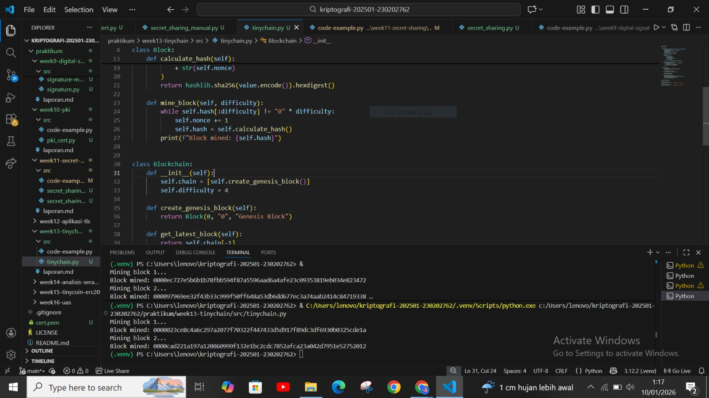

# Laporan Praktikum Kriptografi

Minggu ke-: 13

Topik: TinyChain – Proof of Work (PoW)

Nama: Khusnatun Lina Fitri

NIM: 230202762

Kelas: 5IKRB

---

## 1. Tujuan
1. Menjelaskan peran **hash function** dalam blockchain.  
2. Melakukan simulasi sederhana **Proof of Work (PoW)**.  
3. Menganalisis keamanan cryptocurrency berbasis kriptografi.  
---

## 2. Dasar Teori

Blockchain merupakan teknologi penyimpanan data terdistribusi yang menyimpan catatan transaksi dalam bentuk blok yang saling terhubung dan diamankan menggunakan teknik kriptografi. Setiap blok berisi data transaksi, hash dari blok sebelumnya, serta nilai hash blok itu sendiri, sehingga membentuk rantai yang sulit untuk diubah. Konsep ini memungkinkan terciptanya sistem yang transparan, aman, dan tidak bergantung pada satu pihak pusat. TinyChain merupakan implementasi blockchain sederhana yang digunakan untuk memahami konsep dasar blockchain, termasuk mekanisme konsensus yang digunakan.

Proof of Work (PoW) adalah salah satu mekanisme konsensus yang digunakan dalam blockchain untuk memverifikasi dan menambahkan blok baru ke dalam rantai. Pada PoW, setiap node atau penambang harus menyelesaikan permasalahan komputasi berupa pencarian nilai hash yang memenuhi tingkat kesulitan tertentu. Proses ini membutuhkan daya komputasi yang besar, sehingga menyulitkan pihak yang tidak berwenang untuk memanipulasi data. Dengan adanya PoW, hanya node yang berhasil menyelesaikan perhitungan yang berhak menambahkan blok baru, sehingga keamanan dan keutuhan data blockchain dapat terjaga.

Dalam konteks TinyChain, PoW digunakan sebagai simulasi untuk menunjukkan bagaimana proses penambangan dan validasi blok dilakukan. Meskipun berskala kecil dan tidak sekompleks blockchain publik seperti Bitcoin, TinyChain mampu menggambarkan prinsip kerja PoW secara jelas, mulai dari proses hashing, penentuan tingkat kesulitan, hingga pembentukan blok yang saling terhubung. Dengan demikian, TinyChain menjadi media pembelajaran yang efektif untuk memahami konsep dasar Proof of Work dalam teknologi blockchain.

---

## 3. Alat dan Bahan
- Python 3.12.2 
- Visual Studio Code   
- Git dan akun GitHub  
- Google chrome

---

## 4. Langkah Percobaan

1. Membuat file `tinychain.py` di folder `praktikum/week13-tinychain/src/`.
2. Menyalin kode program dari panduan praktikum.
3. Menjalankan program dengan perintah `python tinychain.py`.
4. Mengerjakan laporan.md
5. Membuat file `hasil.png` di folder `praktikum/week13-tinychain/sreenshoots/`

---

## 5. Source Code

### Langkah 1 dan 2 - Membuat Blokchain

```
import hashlib
import time

class Block:
    def __init__(self, index, previous_hash, data, timestamp=None):
        self.index = index
        self.timestamp = timestamp or time.time()
        self.data = data
        self.previous_hash = previous_hash
        self.nonce = 0
        self.hash = self.calculate_hash()

    def calculate_hash(self):
        value = (
            str(self.index)
            + str(self.timestamp)
            + str(self.data)
            + str(self.previous_hash)
            + str(self.nonce)
        )
        return hashlib.sha256(value.encode()).hexdigest()

    def mine_block(self, difficulty):
        while self.hash[:difficulty] != "0" * difficulty:
            self.nonce += 1
            self.hash = self.calculate_hash()
        print(f"Block mined: {self.hash}")


class Blockchain:
    def __init__(self):
        self.chain = [self.create_genesis_block()]
        self.difficulty = 4

    def create_genesis_block(self):
        return Block(0, "0", "Genesis Block")

    def get_latest_block(self):
        return self.chain[-1]

    def add_block(self, new_block):
        new_block.previous_hash = self.get_latest_block().hash
        new_block.mine_block(self.difficulty)
        self.chain.append(new_block)


# Uji coba blockchain
my_chain = Blockchain()

print("Mining block 1...")
my_chain.add_block(Block(1, "", "Transaksi A → B: 10 Coin"))

print("Mining block 2...")
my_chain.add_block(Block(2, "", "Transaksi B → C: 5 Coin"))
```

Hasilnya : 
```
Mining block 1...
Block mined: 0000023ce8c4a6c297a2077f70322f447433d5d917f89dc3df6930b0325cde1a
Mining block 2...
Block mined: 0000cad221a197a120860999f132e1bc2cdc7852afca23a042d7951e52752012
```

### Langkah 3 - Analisis Proof of Work

Pada kode yang digunakan, proses mining dilakukan dengan mencari nilai hash yang sesuai dengan tingkat kesulitan tertentu, yaitu hash harus memiliki awalan sejumlah angka nol. Semakin besar nilai difficulty yang ditetapkan, semakin banyak percobaan yang harus dilakukan untuk menemukan hash yang valid, sehingga waktu proses mining menjadi lebih lama dan membutuhkan komputasi yang lebih tinggi.

Tingginya tingkat kesulitan ini berfungsi sebagai mekanisme pengaman dalam blockchain. Setiap upaya untuk mengubah isi suatu blok akan mengharuskan pelaku menghitung ulang hash blok tersebut beserta blok-blok berikutnya. Proses ini memerlukan sumber daya komputasi yang besar, sehingga manipulasi data menjadi tidak efisien dan sulit dilakukan.

Oleh karena itu, mekanisme Proof of Work memastikan bahwa blockchain tetap aman dan konsisten. Dengan meningkatnya difficulty, biaya dan waktu yang dibutuhkan untuk melakukan serangan terhadap blockchain juga meningkat, sehingga sistem menjadi lebih tahan terhadap upaya pemalsuan atau perubahan data.

---

## 6. Hasil dan Pembahasan

Hasil eksekusi program tinychain.py :



Pembahasan : 

Berdasarkan pengujian yang telah dilakukan, program Tiny Blockchain yang dibuat sudah dapat berjalan dengan baik setelah dilakukan perbaikan pada bagian kode. Blockchain berhasil dibentuk mulai dari genesis block hingga block transaksi berikutnya. Setiap block ditambang menggunakan mekanisme *proof of work*, dimana sistem akan mencari nilai hash yang sesuai dengan tingkat kesulitan *(difficulty)* yang ditentukan. Hal ini terlihat dari hasil hash yang diawali dengan beberapa angka nol, sehingga dapat disimpulkan bahwa proses mining dan perhitungan hash telah berhasil dilakukan.

Namun pada awal pembuatan program, sempat terjadi error yang menyebabkan kode tidak bisa dijalankan. Error terjadi karena kesalahan penulisan kode deklarasi untuk kelas *Blockchain* yang berada pada baris yang sama dengan perintah *print()*. Setelah error berhasil diatasi, program dapat berjalan kembali tanpa kendala. 

---

## 7. Jawaban Pertanyaan

1. Mengapa fungsi hash sangat penting dalam blockchain?  
2. Bagaimana Proof of Work mencegah double spending?  
3. Apa kelemahan dari PoW dalam hal efisiensi energi?  

Jawaban : 
1. Fungsi hash sangat penting dalam teknologi blockchain karena berperan sebagai identifikasi unik untuk setiap blok data dan memastikan integritas serta keamanan seluruh rantai blok; setiap perubahan sekecil apa pun pada isi blok akan menghasilkan nilai hash yang sangat berbeda, sehingga memudahkan deteksi manipulasi data, dan karena setiap blok menyimpan hash dari blok sebelumnya, struktur ini membuat rantai blok sulit diubah tanpa konsensus jaringan.

2. Proof of Work (PoW) mencegah double spending dengan mewajibkan penambang melakukan kerja komputasi besar untuk menambahkan blok baru ke blockchain, sehingga setiap transaksi harus divalidasi dan dimasukkan dalam blok yang telah melalui proses hashing kompleks, dan karena manipulasi blok yang telah diterima membutuhkan perhitungan ulang seluruh rantai yang sangat mahal secara komputasi dan tidak praktis, percobaan menggunakan satu aset digital lebih dari sekali akan ditolak oleh jaringan.

3. Kelemahan utama dari mekanisme konsensus Proof of Work adalah konsumsi energi yang sangat tinggi karena penambang harus terus melakukan perhitungan komputasi kompleks untuk menemukan nilai hash yang memenuhi tingkat kesulitan, sehingga proses mining memerlukan daya listrik dan sumber daya komputasi yang besar yang berdampak pada biaya operasional tinggi dan dampak lingkungan, menjadikan PoW kurang efisien dibandingkan mekanisme lain yang lebih hemat energi seperti Proof of Stake.
---

## 8. Kesimpulan
Berdasarkan hasil praktikum yang telah dilakukan, program Tiny Blockchain berhasil berjalan dengan baik setelah dilakukan perbaikan pada kesalahan penulisan kode. Selain itu sistem juga mampu mengimplementasikan konsep dasar blockchain, seperti hashing, proof of work, dan hubungan antar blok melalui *previous_hash*. Dengan demikian, praktikum tiny chain dengan *proof of work* berhasil menunjukan cara kerja pembentukan blockchain sederhana dan mekanisme keamanan data mellaui proses mining.

---

## 9. Daftar Pustaka
 

---

## 10. Commit Log

```
commit week13-tinychain
Author: Khusnatun Lina Fitri <husnatunlinafitri@gmail.com>
Date:   2025-01-13

   week13-tinychain: TinyChain – Proof of Work (PoW)
```
