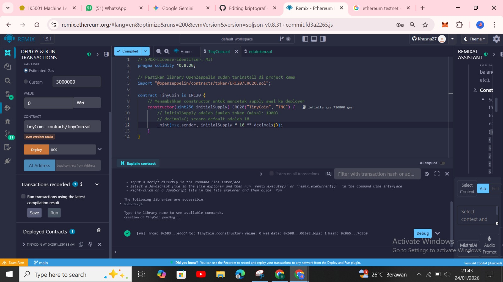
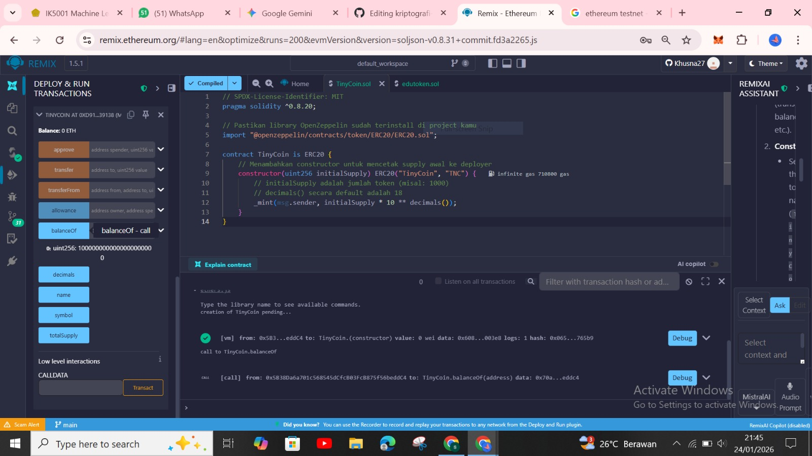
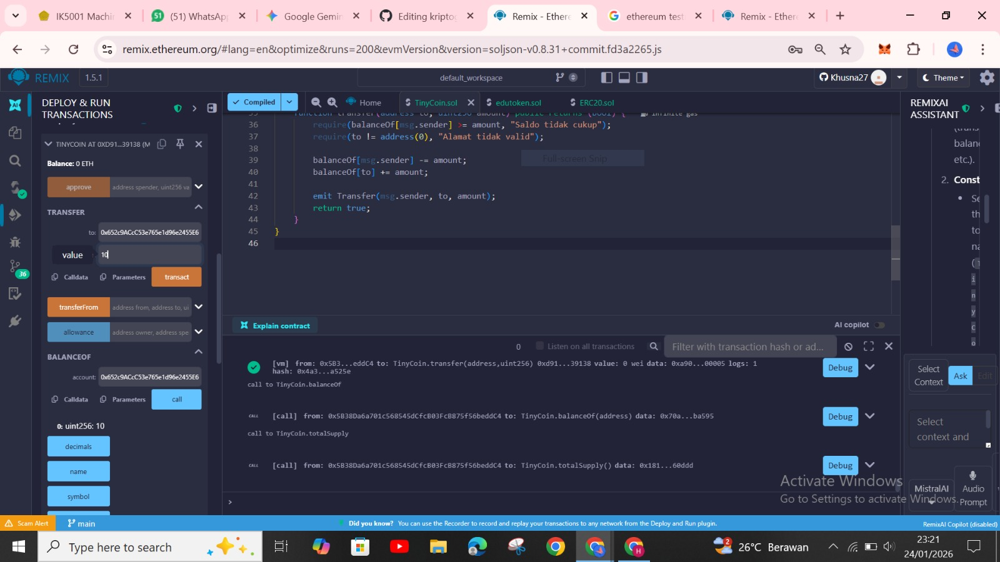
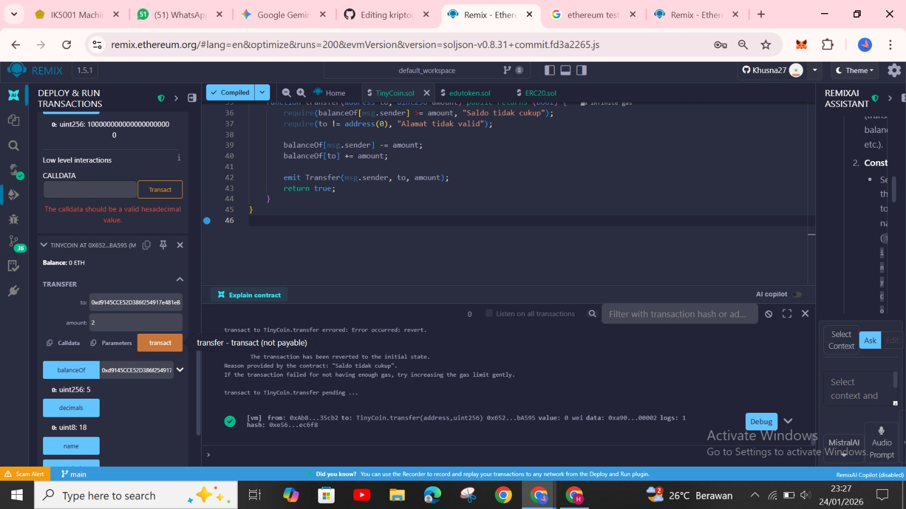
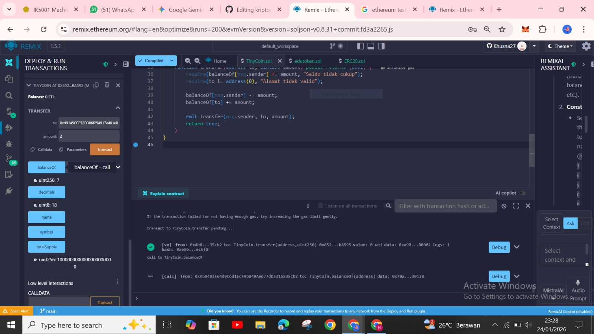

# Laporan Praktikum Kriptografi
Minggu ke-: 15
Topik: Proyek Kelompok – TinyCoin ERC20
Nama:Khusnatun Lina Fitri
NIM: 230202762
Kelas: 5IKRB

---

## 1. Tujuan

1. Mengembangkan proyek sederhana berbasis algoritma kriptografi.
2. Mendokumentasikan proses implementasi proyek ke dalam repository Git.
3. Menyusun laporan teknis hasil proyek akhir.

---

## 2. Dasar Teori

TinyCoin merupakan token digital yang dibangun di atas blockchain Ethereum dengan menggunakan standar ERC-20. Ethereum menyediakan platform terdesentralisasikan yang mendukung eksekusi smart contract, yaitu program yang berjalan otomatis di jaringan blockchain. Dengan smart contract, seluruh transaksi TinyChoin dicatat secara transparan, aman, dan tidak dapat diubah, sehingga tidak memerlukan pihak ketiga sebagai perantara.

Standar ERC-20 mendefinisikan fungsi dasar seperti transfer, balance0f, dan totalSupply agar token dapat digunakan secara luas pada ekosistem Ethereum termasuk wallet dan aplikasi terdesentralisasi. Dengan mengikuti standar ini, TinyChoin menjadi kompatibel dengan berbagai layanan blockchain tanpa perlu penyesuaian tambahan.

TinyCoin digunakan sebagai token pembelajaran untuk memahami konsep dasar kriptografi dan blockchain, khususnya pengelolaan aset digital berbasis smart contract. Melalui implementasi TinyCoin ERC-20, pengguna dapat mempelajari proses pembuatan token, pengiriman aset digital, serta pentingnya keamanan smart contract dalam menjaga keandalan sistem blockchain.

---

## 3. Alat dan Bahan

- Remix IDE 
- Git dan akun GitHub  
- Library OpenZeppelin
- Google Chrome

---

## 4. Langkah Percobaan

1. Membuat file `TinyCoin.sol` di Remix.IDE
2. Menyalin kode program dari panduan praktikum.
3. Menjalankan program dengan klik menu compile.
4. Lalu masuk ke bagian deploy pilih vm pada bagian environment dan masukan nilai initialsupply lalu klik deploy dan contract berhasil dibuat.
5. Menu balanceof untuk mengecek nilai initial supply dengan memasukan alamat account.
6. Menu transfer untuk melakukan transfer dengan cara memasukan alamat account lain dan masukan nilai kemudian klik transact dan akan berhasil jika pada bagian terminal ada centang hijau.

---

## 5. Source Code

### Membuat Kontrak ERC-20.

Membuat file dengan nama TinyCoin.sol yang telah dimodifikasi diremix ide.
```
// SPDX-License-Identifier: MIT
pragma solidity ^0.8.0;

contract TinyCoin {

    // =========================
    // Informasi Token
    // =========================
    string public name = "TinyCoin";
    string public symbol = "TNC";
    uint8 public decimals = 18;
    uint256 public totalSupply;

    // =========================
    // Penyimpanan Saldo
    // =========================
    mapping(address => uint256) public balanceOf;

    // =========================
    // Event (standar ERC20)
    // =========================
    event Transfer(address indexed from, address indexed to, uint256 value);

    // =========================
    // Constructor
    // =========================
    constructor(uint256 initialSupply) {
        totalSupply = initialSupply * 10 ** uint256(decimals);
        balanceOf[msg.sender] = totalSupply;
    }

    // =========================
    // Fungsi Transfer
    // =========================
    function transfer(address to, uint256 amount) public returns (bool) {
        require(balanceOf[msg.sender] >= amount, "Saldo tidak cukup");
        require(to != address(0), "Alamat tidak valid");

        balanceOf[msg.sender] -= amount;
        balanceOf[to] += amount;

        emit Transfer(msg.sender, to, amount);
        return true;
    }
}
```

---

## 6. Hasil dan Pembahasan

Hasil eksekusi program TinyCoin.sol di REMIX.IDE :



Gambar diatas merupakan hasil deploy smart contract untuk token TinyCoin.sol pada Remix IDE. Kontrak dirancang dengan menggunakan standar ERC-20 dan di dideploy ke Remix VM (Osaka) dengan memasukan nilai initial supply sebesar 1000. Setelah itu klik tombol deploy dan pada bagian terminal akan muncul tanda centang hijau yang menandakan transaksi berhasil dieksekusi sehingga smart kontrak telah aktif.



Setelah berhasil melakukan deploy contact dibagian bawah deployed contract pilih menu BalanceOf dengan memasukan alamat akun lalu klik balanceof dan jumlah saldo akan muncul sebesar 1000 dengan 18 decimal dibelakangnya.



Pada bagian transfer saya menambahkan kode supaya token bisa melakukan transaksi. Untuk dapat melakukan transfer kita juga akan membuat akun 2 dengan cara deploy ulang contract. Setelah berhasil copy pada bagian deploy contract akun 2 dan masuk ke akun 1 lagi untuk melakukan transaksi dengan memilih menu transfer dan masukan alamat akun 2 dan masukan jumlah nilai yang akan di transfer.


Setelah memasukan nilai yang akan di transfer klik menu transact jika berhasil pada bagian terminal akan muncul tanda centang hijau yang menandakan akun 1 berhasil transfer ke akun 2.


Setelah berhasil melakukan tansfer pada bagian balanceof masukan alamat akun 2 dan klik balanceof saldo yang sebelumnya 10 setelah menerima transfer sebesar 10 kini telah bertambah menjadi 20.



Lalu kita coba melakukan transfer dari akun 2 ke akun 1 dengan masuk ke deployed akun 2. Pilih menu transfer dan masukan alamat akun 1 lalu klik transact jika berhasil maka pada bagian terminal akan muncul centang hijau seperti pada gambar diatas yang menandakan transfer berhasil dilakakukan.



Kita coba cek apakah saldo pada akun 1 telah bertambah dengan pilih menu balanceof pada akun 2 dan masukan alamat akun 1 lalu klik balance of. Pada bagian nilai yang sebelumnya 5 telah bertambah menjadi 7 karena telah menerima transfer dari akun 1 sebesar 2 nilai.

---

## 7. Jawaban Pertanyaan

1. Apa fungsi utama ERC20 dalam ekosistem blockchain?  
2. Bagaimana mekanisme transfer token bekerja dalam kontrak ERC20?  
3. Apa risiko utama dalam implementasi smart contract dan bagaimana cara mitigasinya?

Jawaban :

1. ERC20 berfungsi sebagai standar pembuatan token di blockchain Ethereum. Dengan adanya standar ini, token yang dibuat bisa digunakan dan dikenali oleh berbagai wallet, exchange, dan aplikasi berbasis blockchain tanpa perlu penyesuaian tambahan. ERC20 memudahkan pengembang dalam membuat token dan memastikan token tersebut kompatibel dengan ekosistem Ethereum.

2.Transfer token pada ERC20 dilakukan menggunakan fungsi transfer. Ketika fungsi ini dijalankan, sistem akan mengecek saldo pengirim terlebih dahulu. Jika saldo mencukupi, maka saldo pengirim akan dikurangi dan saldo penerima akan ditambahkan sesuai jumlah token yang dikirim. Semua transaksi ini dicatat di blockchain sehingga transparan dan tidak bisa diubah.

3. Risiko utama dalam smart contract biasanya berasal dari kesalahan penulisan kode atau logika program yang kurang tepat, sehingga bisa dimanfaatkan oleh pihak lain. Untuk mengurangi risiko tersebut, pengembang dapat menggunakan library yang sudah terpercaya seperti OpenZeppelin, memakai versi Solidity terbaru, serta melakukan pengujian dan audit sebelum smart contract dijalankan di jaringan utama.
---

## 8. Kesimpulan

Dari praktikum TinyCoin yang telah dilakukan, dapat disimpulkan bahwa smart contract ERC20 berhasil dibuat dan dijalankan dengan baik. Proses deploy, pengecekan saldo, dan transfer token dapat dilakukan sesuai dengan fungsi yang ada pada ERC20. Penggunaan library OpenZeppelin membantu meminimalkan kesalahan dan membuat kontrak lebih aman saat diimplementasikan.

---

## 9. Daftar Pustaka


---

## 10. Commit Log
 
```
week15-tinycoin-erc20
Author: Khusnatun Lina Fitri <husnatunlinafitri@gmail.com>
Date:   2026-01-25

   week15-tinycoin-erc20 : TinyCoin ERC20
```
