# Laporan Praktikum Kriptografi
Minggu ke-: 16

Topik: UAS KRIPTOGRAFI EDUTOKEN

Nama: Khusnatun Lina Fitri  

NIM: 230202762

Kelas: 5IKRB

---

## 1. Tujuan

Projek EduToken dikembangkan dengan beberapa tujuan utama, yaitu:
1.	Mengimplementasikan konsep kriptografi dalam aplikasi pembelajaran berbasis web berbasis blockchain untuk memberikan pemahaman praktis kepada pengguna.
2.	Mengembangkan platform pembelajaran interaktif yang mengintegrasikan materi kriptografi, kuis, dan sistem reward token digital.
3.	Menerapkan teknologi blockchain Ethereum melalui smart contract ERC-20 serta penggunaan MetaMask pada jaringan Sepolia Testnet.
4.	Mendemonstrasikan penerapan protokol keamanan, termasuk hashing, autentikasi, integritas data, dan transaksi token digital.


---

## 2. Dasar Teori

Teknologi blockchain merupakan teknologi terdistribusi yang menawarkan transparansi, keamanan, dan desentralisasi dalam pencatatan data. Dalam bidang pendidikan, blockchain berpotensi digunakan sebagai sistem pendukung pembelajaran, salah satunya melalui mekanisme reward berbasis token digital untuk meningkatkan motivasi dan partisipasi mahasiswa.

Kriptografi merupakan komponen utama dalam blockchain yang berfungsi untuk menjaga keamanan data dan transaksi. Konsep kriptografi seperti hashing, enkripsi, dan digital signature menjadi dasar dalam pengamanan sistem blockchain. Namun, pembelajaran kriptografi sering dianggap sulit karena bersifat abstrak dan kurang aplikatif.

EduToken merupakan platform pembelajaran yang mengintegrasikan konsep kriptografi dengan teknologi blockchain Ethereum. Melalui smart contract ERC-20 yang dikembangkan menggunakan Solidity dan dijalankan pada jaringan Sepolia Testnet, mahasiswa dapat memperoleh token digital sebagai reward setelah menyelesaikan kuis. Implementasi ini memberikan pengalaman langsung dalam memahami mekanisme smart contract, transaksi token, serta keamanan blockchain tanpa biaya transaksi nyata.

---

## 3. Alat dan Bahan

- Visual Studio Code 
- Git dan akun GitHub  
- Remix IDE
- Akun Metamask
- Onrender
- Fron End menggunakan HTML, CSS, JavaScript
- Smart contract menggunakan solidity
- Network menggunakan Ethereum Sepolia

---

## 4. Langkah Percobaan

### 1. Login ke website EduToken
   
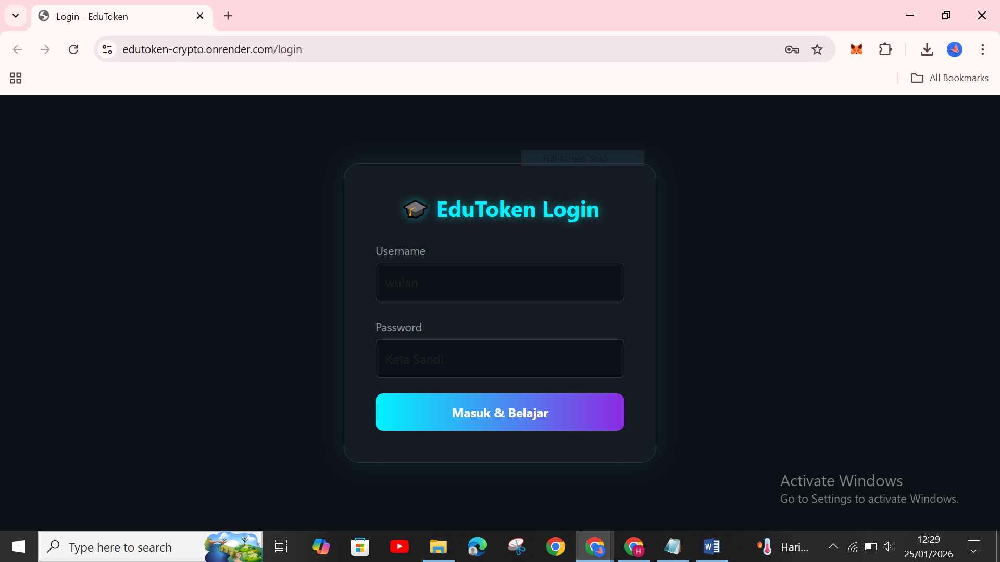

- Login ke website EduToken dengan masuk ke https://edutoken-crypto.onrender.com
- Lalu login dengan username dan password yang sebelumnya sudah pernah dibuat.

### 2. Tampilan Menu Dasboard EduToken

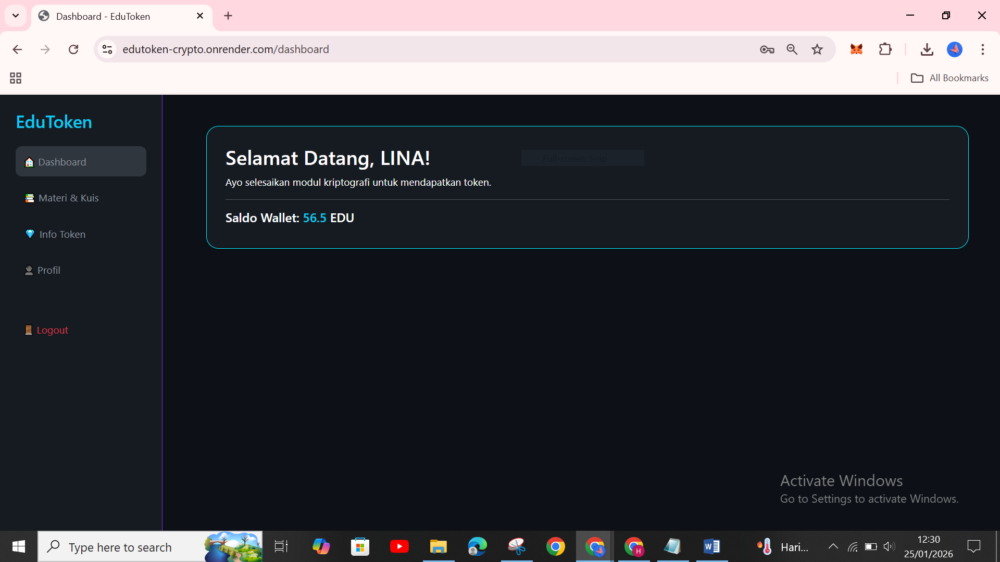

- Setelah berhasil login akan masuk ke dalam menu dashboard di EduToken.

### 3. Tampilan Menu Materi dan Kuis

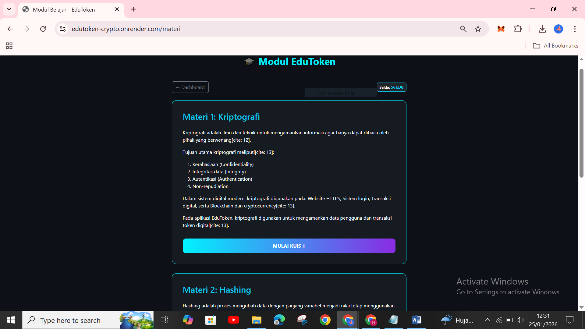

- Setelah  masuk ke dashboard pilih menu materi dan kuis dan coba mengerjakan kuis dengan memilih mulai kuis 1.
- Kuis 2 dan 3 bisa dibuka setelah token memiliki nilai yang cukup banyak.

### 4. Tampilan Quiz

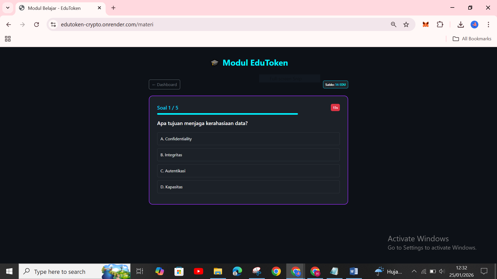

- Setelah memilih mulai kuis terdapat 5 pertanyaan dengan durasi waktu 20 detik pengerjaan untuk masing-masing soal. 

### 5. Tampilan Klaim Token

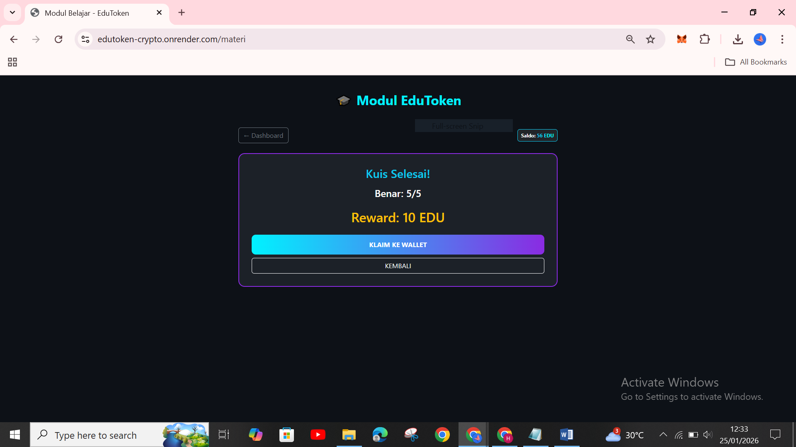

- Setelah selesai mengerjakan kuiz lalu klik klaim token dan akan terhubung ke akun metamask. Sebelum otomatis terhubung, masing-masing pengguna harus menautkan akun metamask terlebih dahulu menggunakan smart contract EduToken.

### 6. Tampilan Konfirmasi Klaim Token Pada Metamask

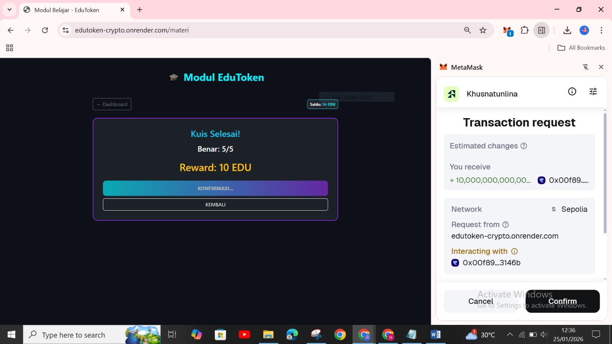
- Lalu pada bagian pop up Metamask klik Confirm supaya token dapat diklaim.

### 7.  Tampilan Notifikasi Berhasil Klaim Token

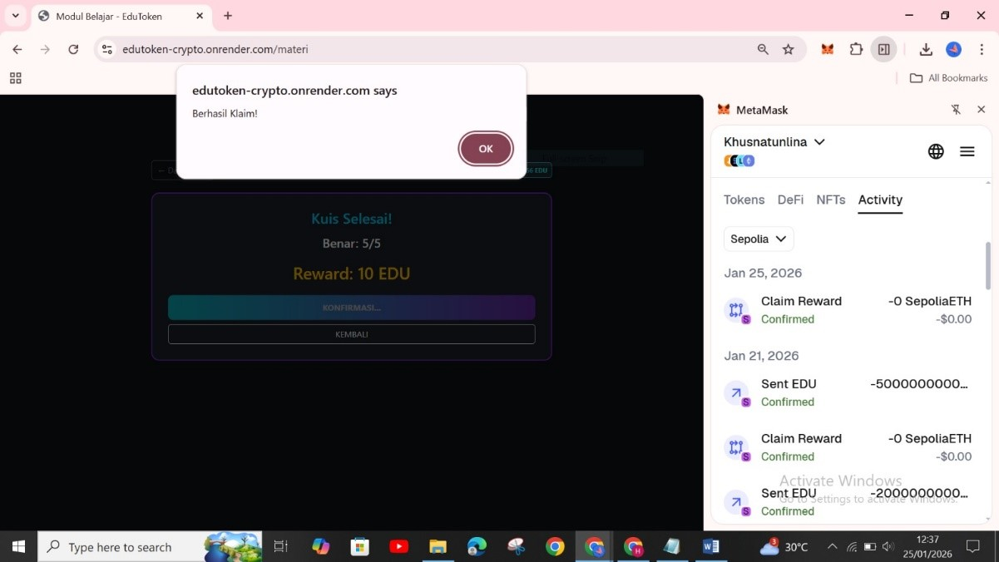

- Setelah dikonfirmasi EduToken akan memberikan notifikasi bahwa token berhasil diklaim dan klik oke.

### 8. Tampilan Menu Info Token dan Transfer

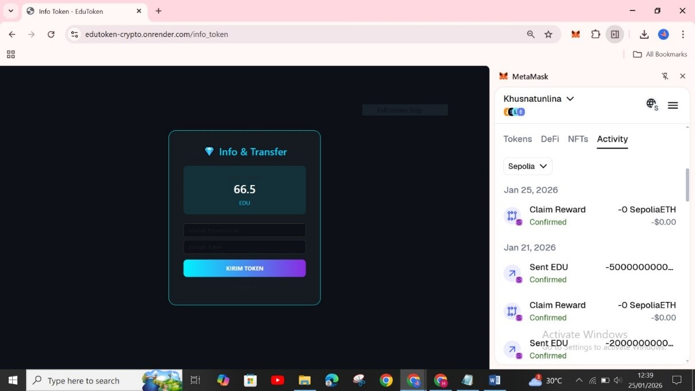

- Pada menu ini terdapat informasi jumlah token dan menu transfer.
- Jika ingin melakukan transfer masukan alamat wallet teman dan masukan jumlah token yang akan di transfer lalu klik kirim token.

### 9. Konfirmasi Metamask

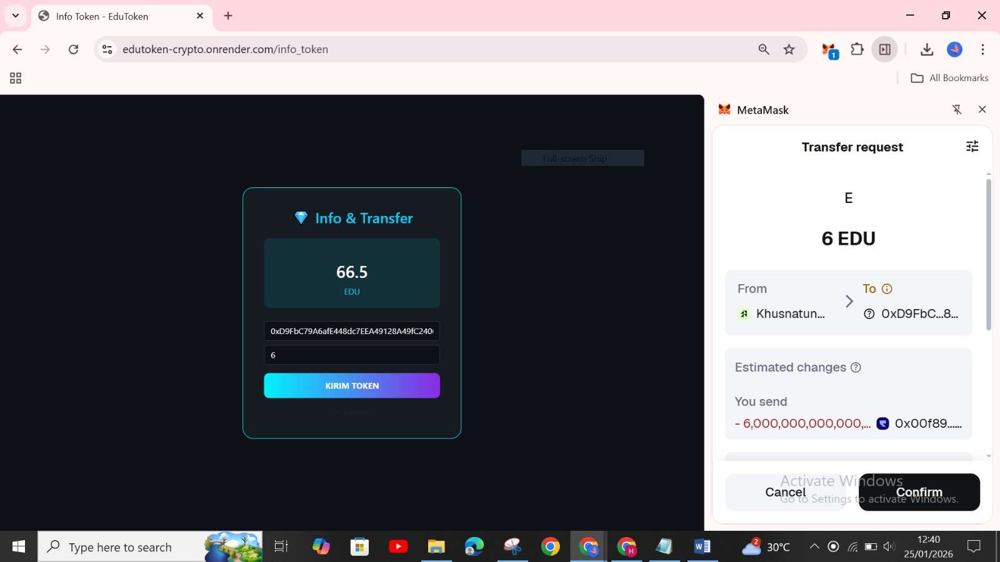

- Setelah memilih kirim token akan muncul pop up metamask untuk persetujuan dan klik confirm supaya transfer token berhasil dilakukan.

### 10. Notifikasi Berhasil Transfer

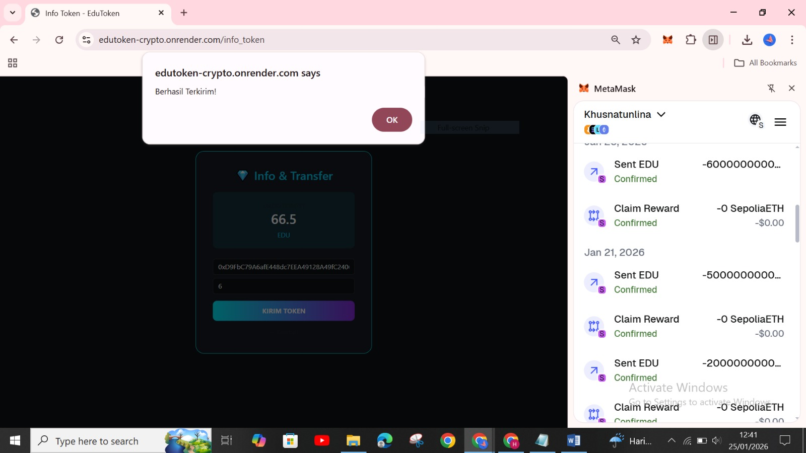

- Setelah melakukan konfirmasi EduToken akan memberikan notifikasi bahwa token berhasil di kirim.

### 11. Menu Profil

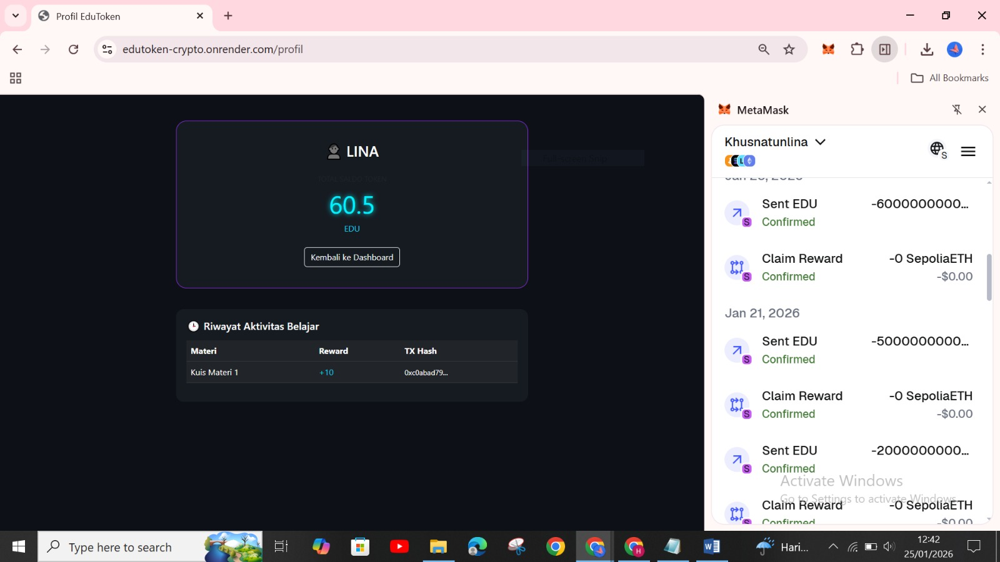

- Pada menu profil terdapat informasi tentang username pengguna, jumlah token dan riwayat aktivitas belajar.
---

## 5. Source Code


---

## 6. Hasil dan Pembahasan

Berdasarkan praktikum yang telah dilakukan, sistem EduToken berhasil diimplementasikan dan berjalan sesuai dengan tujuan. Pengguna dapat login, menghubungkan wallet MetaMask, mengakses materi, mengerjakan kuis, serta menerima reward berupa token EDU yang berhasil dikirim ke wallet melalui transaksi blockchain pada jaringan Ethereum Sepolia Testnet. Hasil praktikum menunjukkan bahwa integrasi aplikasi web dengan blockchain berjalan dengan baik, serta penerapan konsep kriptografi seperti kriptografi asimetris, fungsi hash, dan digital signature dapat diamati secara langsung. Melalui praktikum ini, mahasiswa memperoleh pemahaman yang lebih nyata mengenai penerapan kriptografi, meskipun sistem masih memiliki keterbatasan karena berjalan pada jaringan testnet dan bergantung pada keamanan wallet pengguna.

Berikut merupakan kelebihan dan kekurangan sistem EduToken :

- Kelebihan Sistem :

1. Menggunakan teknologi blockchain yang bersifat transparan dan immutable.
2. Distribusi token dilakukan melalui smart contract ERC-20, sehingga lebih aman dan terotomatisasi.
3. Keamanan transaksi terjamin dengan penerapan kriptografi asimetris, fungsi hash, dan digital signature.
4. Private key tidak disimpan di server, karena dikelola langsung oleh MetaMask.
5. Sistem reward berbasis token meningkatkan interaktivitas dan motivasi belajar pengguna.
6. Memberikan pengalaman pembelajaran kriptografi secara praktis dan aplikatif.

- Kekurangan Sistem

1. Sistem masih berjalan pada jaringan testnet (Sepolia) sehingga belum digunakan di lingkungan produksi.
2. Keamanan akun sangat bergantung pada kesadaran pengguna dalam menjaga private key wallet.
3. Smart contract belum melalui audit keamanan secara mendalam.
4. Skalabilitas sistem masih terbatas dan belum mendukung untuk digunakan oleh banyak pengguna secara bersamaan.
5. Ketergantungan pada koneksi internet dan ekstensi MetaMask di sisi pengguna.

---

## 7. Jawaban Pertanyaan


## 8. Kesimpulan

Berdasarkan seluruh tahapan perancangan, pengembangan, dan pengujian yang telah dilakukan, sistem EduToken berhasil diimplementasikan sebagai Learning Management System (LMS) interaktif yang terintegrasi dengan teknologi blockchain Ethereum berbasis ERC-20 pada jaringan Sepolia Testnet. Penerapan prinsip kriptografi seperti kriptografi asimetris, hashing Keccak-256, dan tanda tangan digital ECDSA terbukti mampu menjaga keamanan, autentikasi, serta integritas transaksi token EDU. Selain itu, penggunaan token sebagai bentuk gamifikasi pembelajaran menunjukkan bahwa teknologi blockchain dapat menjembatani konsep kriptografi yang bersifat teoritis dengan penerapan Web3 yang lebih praktis dan aplikatif.

---

## 9. Daftar Pustaka


---

## 10. Commit Log

```
commit week16 - UAS KRIPTOGRAFI EDUTOKEN

Author: Khusnatun Lina Fitri <husnatunlinafitri@gmail.com>
Date:   2026-01-25

    week16-UAS EduToken : UAS KRIPTOGRAFI EDUTOKEN
```
