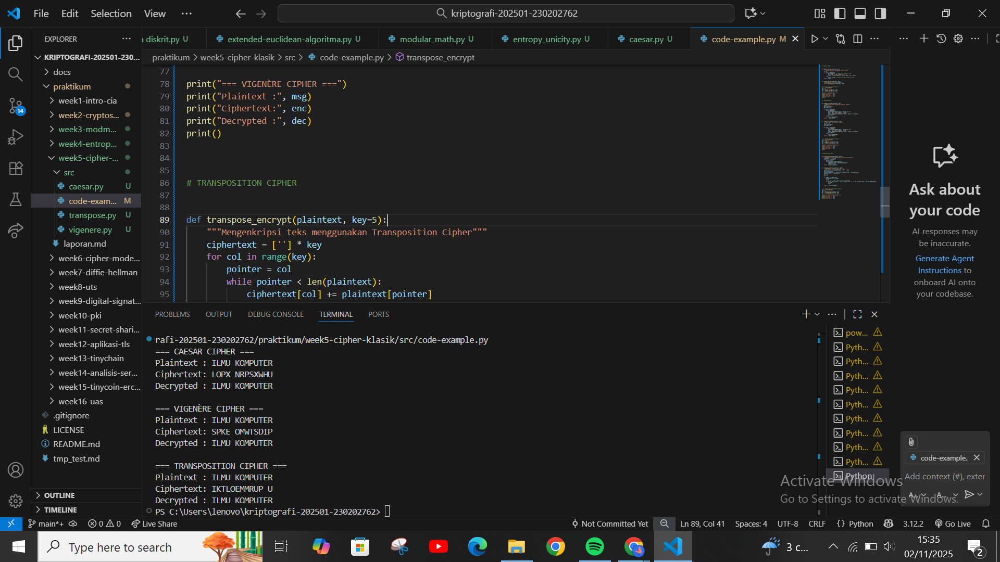

# Laporan Praktikum Kriptografi
Minggu ke-: 5
Topik:  Cipher Klasik (Caesar, Vigenère, Transposisi) 
Nama:Khusnatun Lina Fitri 
NIM: 230202762 
Kelas: 5IKRB 

---

## 1. Tujuan
1. Menerapkan algoritma Caesar Cipher untuk enkripsi dan dekripsi teks.
2. Menerapkan algoritma Vigenère Cipher dengan variasi kunci.
3. Mengimplementasikan algoritma transposisi sederhana.
4. Menjelaskan kelemahan algoritma kriptografi klasik.

---

## 2. Dasar Teori
(Ringkas teori relevan (cukup 2–3 paragraf).  
Contoh: definisi cipher klasik, konsep modular aritmetika, dll.  )

---

## 3. Alat dan Bahan
(- Python 3.x  
- Visual Studio Code / editor lain  
- Git dan akun GitHub  
- Library tambahan (misalnya pycryptodome, jika diperlukan)  )

---

## 4. Langkah Percobaan
(Tuliskan langkah yang dilakukan sesuai instruksi.  
Contoh format:
1. Membuat file `caesar_cipher.py` di folder `praktikum/week2-cryptosystem/src/`.
2. Menyalin kode program dari panduan praktikum.
3. Menjalankan program dengan perintah `python caesar_cipher.py`.)

---

## 5. Source Code
### Langkah 1 - Implementasi Caesar Cipher
```
def caesar_encrypt(plaintext, key):
    result = ""
    for char in plaintext:
        if char.isalpha():
            shift = 65 if char.isupper() else 97
            result += chr((ord(char) - shift + key) % 26 + shift)
        else:
            result += char
    return result

def caesar_decrypt(ciphertext, key):
    return caesar_encrypt(ciphertext, -key)

# Contoh uji
msg = "CLASSIC CIPHER"
key = 3
enc = caesar_encrypt(msg, key)
dec = caesar_decrypt(enc, key)
print("Plaintext :", msg)
print("Ciphertext:", enc)
print("Decrypted :", dec)
```
Hasilnya : 
```
Plaintext : CLASSIC CIPHER
Ciphertext: FODVVLF FLSKHU
Decrypted : CLASSIC CIPHER
```

### Langkah 2 - Implementasi Vigenere Cipher

```
def vigenere_encrypt(plaintext, key):
    result = []
    key = key.lower()
    key_index = 0
    for char in plaintext:
        if char.isalpha():
            shift = ord(key[key_index % len(key)]) - 97
            base = 65 if char.isupper() else 97
            result.append(chr((ord(char) - base + shift) % 26 + base))
            key_index += 1
        else:
            result.append(char)
    return "".join(result)

def vigenere_decrypt(ciphertext, key):
    result = []
    key = key.lower()
    key_index = 0
    for char in ciphertext:
        if char.isalpha():
            shift = ord(key[key_index % len(key)]) - 97
            base = 65 if char.isupper() else 97
            result.append(chr((ord(char) - base - shift) % 26 + base))
            key_index += 1
        else:
            result.append(char)
    return "".join(result)

# Contoh uji
msg = "KRIPTOGRAFI"
key = "KEY"
enc = vigenere_encrypt(msg, key)
dec = vigenere_decrypt(enc, key)
print("Plaintext :", msg)
print("Ciphertext:", enc)
print("Decrypted :", dec)
```
Hasilnya : 
```
Plaintext : KRIPTOGRAFI
Ciphertext: UVGZXMQVYPM
Decrypted : KRIPTOGRAFI
```

### Langkah 3 - Implementasi Transposisi Sederhana
```
def transpose_encrypt(plaintext, key=5):
    ciphertext = [''] * key
    for col in range(key):
        pointer = col
        while pointer < len(plaintext):
            ciphertext[col] += plaintext[pointer]
            pointer += key
    return ''.join(ciphertext)

def transpose_decrypt(ciphertext, key=5):
    num_of_cols = int(len(ciphertext) / key + 0.9999)
    num_of_rows = key
    num_of_shaded_boxes = (num_of_cols * num_of_rows) - len(ciphertext)
    plaintext = [''] * num_of_cols
    col = 0
    row = 0
    for symbol in ciphertext:
        plaintext[col] += symbol
        col += 1
        if (col == num_of_cols) or (col == num_of_cols - 1 and row >= num_of_rows - num_of_shaded_boxes):
            col = 0
            row += 1
    return ''.join(plaintext)

# Contoh uji
msg = "TRANSPOSITIONCIPHER"
enc = transpose_encrypt(msg, key=5)
dec = transpose_decrypt(enc, key=5)
print("Plaintext :", msg)
print("Ciphertext:", enc)
print("Decrypted :", dec)
```
Hasilnya :
```
Plaintext : TRANSPOSITIONCIPHER
Ciphertext: TPIPROOHASNENICRSTI
Decrypted : TRANSPOSITIONCIPHER
```

### Langkah 4 - Contoh uji coba ketiganya
```

#  CAESAR CIPHER


def caesar_encrypt(plaintext, key):
    """Mengenkripsi teks menggunakan Caesar Cipher"""
    result = ""
    for char in plaintext:
        if char.isalpha():  # hanya huruf yang dienkripsi
            shift = 65 if char.isupper() else 97
            result += chr((ord(char) - shift + key) % 26 + shift)
        else:
            result += char  # karakter non-huruf tidak berubah
    return result


def caesar_decrypt(ciphertext, key):
    """Mendekripsi teks Caesar Cipher"""
    return caesar_encrypt(ciphertext, -key)


# --- Contoh Uji Caesar Cipher ---
msg = "ILMU KOMPUTER "
key = 3
enc = caesar_encrypt(msg, key)
dec = caesar_decrypt(enc, key)

print("=== CAESAR CIPHER ===")
print("Plaintext :", msg)
print("Ciphertext:", enc)
print("Decrypted :", dec)
print()


#  VIGENÈRE CIPHER


def vigenere_encrypt(plaintext, key):
    """Mengenkripsi teks menggunakan Vigenère Cipher"""
    result = []
    key = key.lower()
    key_index = 0

    for char in plaintext:
        if char.isalpha():
            shift = ord(key[key_index % len(key)]) - 97
            base = 65 if char.isupper() else 97
            result.append(chr((ord(char) - base + shift) % 26 + base))
            key_index += 1
        else:
            result.append(char)
    return "".join(result)


def vigenere_decrypt(ciphertext, key):
    """Mendekripsi teks Vigenère Cipher"""
    result = []
    key = key.lower()
    key_index = 0

    for char in ciphertext:
        if char.isalpha():
            shift = ord(key[key_index % len(key)]) - 97
            base = 65 if char.isupper() else 97
            result.append(chr((ord(char) - base - shift) % 26 + base))
            key_index += 1
        else:
            result.append(char)
    return "".join(result)


# --- Contoh Uji Vigenère Cipher ---
msg = "ILMU KOMPUTER"
key = "KEY"
enc = vigenere_encrypt(msg, key)
dec = vigenere_decrypt(enc, key)

print("=== VIGENÈRE CIPHER ===")
print("Plaintext :", msg)
print("Ciphertext:", enc)
print("Decrypted :", dec)
print()


# TRANSPOSITION CIPHER


def transpose_encrypt(plaintext, key=5):
    """Mengenkripsi teks menggunakan Transposition Cipher"""
    ciphertext = [''] * key
    for col in range(key):
        pointer = col
        while pointer < len(plaintext):
            ciphertext[col] += plaintext[pointer]
            pointer += key
    return ''.join(ciphertext)


def transpose_decrypt(ciphertext, key=5):
    """Mendekripsi teks Transposition Cipher"""
    num_of_cols = int(len(ciphertext) / key + 0.9999)
    num_of_rows = key
    num_of_shaded_boxes = (num_of_cols * num_of_rows) - len(ciphertext)
    plaintext = [''] * num_of_cols
    col = 0
    row = 0

    for symbol in ciphertext:
        plaintext[col] += symbol
        col += 1
        # Jika kolom penuh, lanjut ke baris berikutnya
        if (col == num_of_cols) or (col == num_of_cols - 1 and row >= num_of_rows - num_of_shaded_boxes):
            col = 0
            row += 1

    return ''.join(plaintext)


# --- Contoh Uji Transposition Cipher ---
msg = "ILMU KOMPUTER"
key = 5
enc = transpose_encrypt(msg, key)
dec = transpose_decrypt(enc, key)

print("=== TRANSPOSITION CIPHER ===")
print("Plaintext :", msg)
print("Ciphertext:", enc)
print("Decrypted :", dec)


```
Hasilnya :
```
=== CAESAR CIPHER ===
Plaintext : ILMU KOMPUTER   
Ciphertext: LOPX NRPSXWHU   
Decrypted : ILMU KOMPUTER   

=== VIGENÈRE CIPHER ===     
Plaintext : ILMU KOMPUTER   
Ciphertext: SPKE OMWTSDIP   
Decrypted : ILMU KOMPUTER   

=== TRANSPOSITION CIPHER ===
Plaintext : ILMU KOMPUTER   
Ciphertext: IKTLOEMMRUP U   
Decrypted : ILMU KOMPUTER
```
---

## 6. Hasil dan Pembahasan

### 1. Caesar Cipher

Hasil eksekusi program Caesar Cipher:




---

## 7. Jawaban Pertanyaan
(Jawab pertanyaan diskusi yang diberikan pada modul.  
- Pertanyaan 1: …  
- Pertanyaan 2: …  
)
---

## 8. Kesimpulan
(Tuliskan kesimpulan singkat (2–3 kalimat) berdasarkan percobaan.  )

---

## 9. Daftar Pustaka
(Cantumkan referensi yang digunakan.  
Contoh:  
- Katz, J., & Lindell, Y. *Introduction to Modern Cryptography*.  
- Stallings, W. *Cryptography and Network Security*.  )

---

## 10. Commit Log
(Tuliskan bukti commit Git yang relevan.  
Contoh:
```
commit abc12345
Author: Nama Mahasiswa <email>
Date:   2025-09-20

    week2-cryptosystem: implementasi Caesar Cipher dan laporan )
```
