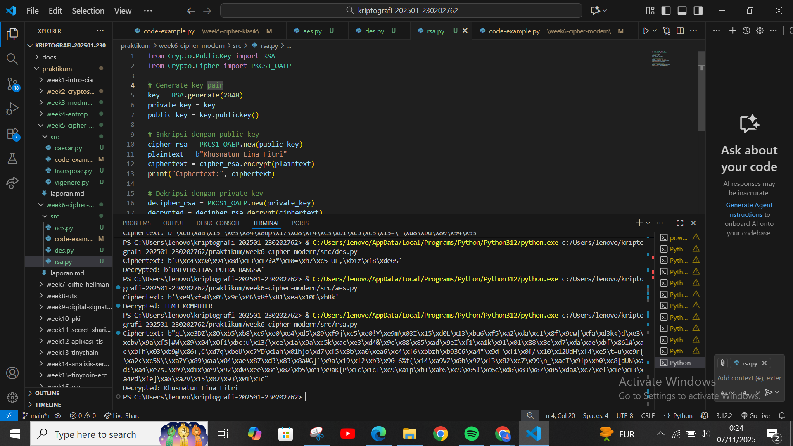

# Laporan Praktikum Kriptografi
Minggu ke-: 6  
Topik: Cipher Modern (DES, AES, RSA) 
Nama: Khusnatun Lina Fitri
NIM: 230202762
Kelas: 5IKRB

---

## 1. Tujuan
1. Mengimplementasikan algoritma **DES** untuk blok data sederhana.  
2. Menerapkan algoritma **AES** dengan panjang kunci 128 bit.  
3. Menjelaskan proses pembangkitan kunci publik dan privat pada algoritma **RSA**.  

---

## 2. Dasar Teori
1. DES (Data Encryption Standard), merupakan algoritma enkripsi simetris dengan panjang kunci 56-bit dan ukuran blok 64-bit serta melibatkan 16 putaran enkripsi yang menggunakan permutasi dan substitusi.
2. AES (Advanced Encryption Standard), digunakan untuk menggantikan DES sebagai standar enkripsi blok dengan ukuran blok 128-bit dan panjang kunci yang dapat berupa 128-bit, 192-bit, atau 256-bit. Memiliki putaran yang berbeda berdasarkan panjang kunci (10, 12, atau 14 putaran). Langkah-langkah utama meliputi AddRoundKey, SubBytes, ShiftRows, MixColumns.
3. RSA (Rivest hamir Adleman), merupakan algoritma asimetris dengan kunci publik untuk enkripsi dan kunci privat untuk dekripsi. Sering digunakan untuk tanda tangan digital.
---

## 3. Alat dan Bahan
- Python 3.x  
- Visual Studio Code / editor lain  
- Git dan akun GitHub  
- Google Chrome
- pip install pycryptodome
---

## 4. Langkah Percobaan
(Tuliskan langkah yang dilakukan sesuai instruksi.  
Contoh format:
1. Membuat file `caesar_cipher.py` di folder `praktikum/week2-cryptosystem/src/`.
2. Menyalin kode program dari panduan praktikum.
3. Menjalankan program dengan perintah `python caesar_cipher.py`.)

---

## 5. Source Code
1. Langkah 1-DES
```
from Crypto.Cipher import DES
from Crypto.Random import get_random_bytes

key = get_random_bytes(8)  # kunci 64 bit (8 byte)
cipher = DES.new(key, DES.MODE_ECB)

plaintext = b"ABCDEFGH"
ciphertext = cipher.encrypt(plaintext)
print("Ciphertext:", ciphertext)

decipher = DES.new(key, DES.MODE_ECB)
decrypted = decipher.decrypt(ciphertext)
print("Decrypted:", decrypted)
```
Hasilnya :
```
Ciphertext: b'\xfb=\x85\x07\x1ba\xb9\xee'
Decrypted: b'ABCDEFGH'
```

2. Langkah 2-AES 128 bit
```
from Crypto.Cipher import AES
from Crypto.Random import get_random_bytes

key = get_random_bytes(16)  # 128 bit key
cipher = AES.new(key, AES.MODE_EAX)

plaintext = b"Modern Cipher AES Example"
ciphertext, tag = cipher.encrypt_and_digest(plaintext)

print("Ciphertext:", ciphertext)

# Dekripsi
cipher_dec = AES.new(key, AES.MODE_EAX, nonce=cipher.nonce)
decrypted = cipher_dec.decrypt(ciphertext)
print("Decrypted:", decrypted.decode())
```
Hasilnya :
```
Ciphertext: b'\xe0\x0b\xdf\x84\xdb\x8c\xa5y\xd0U\x18]\x16\xe4\xd6 \x81\x8d\xc5\xc7\xb0\xc83\xb2\xa8'
Decrypted: Modern Cipher AES Example
```
---
3. Langkah 3-RSA
```
from Crypto.PublicKey import RSA
from Crypto.Cipher import PKCS1_OAEP

# Generate key pair
key = RSA.generate(2048)
private_key = key
public_key = key.publickey()

# Enkripsi dengan public key
cipher_rsa = PKCS1_OAEP.new(public_key)
plaintext = b"RSA Example"
ciphertext = cipher_rsa.encrypt(plaintext)
print("Ciphertext:", ciphertext)

# Dekripsi dengan private key
decipher_rsa = PKCS1_OAEP.new(private_key)
decrypted = decipher_rsa.decrypt(ciphertext)
print("Decrypted:", decrypted.decode())
```
Hasilnya :
```
Ciphertext: b'Q\xca\xad\xbaQ\xffU\x91w\xaa\xc8 \x86\x08!\xec\x9f~\xc6AM\x90t\xe1\x0fR\x84\x96{0^\x00E>\xf1\xadV7\xdb\xb2\xd4Ys\x141|T8\x1fA\x81\xe2&Je\xc85\\\x0f\t>LS\xce5\x87\xf9e\xcaf\xe2\x02\xe9\x80\x0co&\xa8\xc0\xf6\xf5\xf8\x13\xc9\x9c\t]\xe8\x85\x95(=v2\x9d@\xb3qn\xc4\xe5\xaa\xf5\xb4\xe4r\xbe\x15\xeaK-\x82\x04\x9a\x9c\xf2_\xde"B\x06\xcb\xb0\x15\x93\x00\x19\xc8\x1f\x80\x8e\xd9hU[[\x86q\x88=iJF]\xc5\x98\xcd\xe5\xdd\xb2\x99jY\t\x84\xf7\x8a"\x90\x8fc\xa5/\x04\xfe\x98\xd2\r\x95\x86z\xec\x82\xcc\x1e\xd7u\xa0\xfe\x13\xabz\xe8\x8e-\xff\xed\x04\xe1\x83q\xfc\xd8\xd1Y\xa0\xb8k\xab/\xcb\x1e\xd9\xfd\xaf\xc5ypc\xd6\xf2\x03\x88\\E]\x0c\x83\\\x8e\x1f\xc7\xe8\x16wG\x8b\xd08U\x12\x99\x8b\xa4\xaa~6\xc8\x12[M>{\xe4\xaai\x04\x92F\x9b\'\x81\x9c\xe9<\x05'
Decrypted: RSA Example
```
---

4. Hasil Implementasi ketiganya
```
#==== IMPLEMENTASI AES (Advanced Encryption Standard) ===
from Crypto.Cipher import AES
from Crypto.Random import get_random_bytes

#AES menggunakan kunci 128 bit (16 byte)
key = get_random_bytes(16)
cipher = AES.new(key, AES.MODE_EAX)

#Data yang akan dienkripsi
plaintext = b"ILMU KOMPUTER"

#Enkripsi AES (menghasilkan ciphertext dan tag autentikasi)
ciphertext, tag = cipher.encrypt_and_digest(plaintext)

print("=== IMPLEMENTASI AES ===")
print("Kunci (Key):", key)
print("Nonce:", cipher.nonce)
print("Ciphertext:", ciphertext)
print("Tag:", tag)

#Dekripsi AES
cipher_dec = AES.new(key, AES.MODE_EAX, nonce=cipher.nonce)
decrypted = cipher_dec.decrypt(ciphertext)
print("Decrypted:", decrypted.decode())
print("\n")


#=== IMPLEMENTASI DES (Data Encryption Standard) ===
from Crypto.Cipher import DES
from Crypto.Random import get_random_bytes

#DES menggunakan kunci 64 bit (8 byte)
key = get_random_bytes(8)
cipher = DES.new(key, DES.MODE_ECB)

#Data harus kelipatan 8 byte untuk mode ECB
plaintext = b"UNIVERSITAS PUTRA BANGSA"

#Karena panjang plaintext bukan kelipatan 8, tambahkan padding manual
while len(plaintext) % 8 != 0:
    plaintext += b' '  # padding spasi

#Enkripsi DES
ciphertext = cipher.encrypt(plaintext)

print("=== IMPLEMENTASI DES ===")
print("Kunci (Key):", key)
print("Ciphertext:", ciphertext)

#Dekripsi DES
decipher = DES.new(key, DES.MODE_ECB)
decrypted = decipher.decrypt(ciphertext)
print("Decrypted:", decrypted.strip())
print("\n")

#=== IMPLEMENTASI RSA (Rivest-Shamir-Adleman) ===
from Crypto.PublicKey import RSA
from Crypto.Cipher import PKCS1_OAEP

#Generate pasangan kunci RSA (private & public)
key = RSA.generate(2048)
private_key = key
public_key = key.publickey()

#Enkripsi RSA menggunakan public key
cipher_rsa = PKCS1_OAEP.new(public_key)
plaintext = b"Khusnatun Lina Fitri"
ciphertext = cipher_rsa.encrypt(plaintext)

print("=== IMPLEMENTASI RSA ===")
print("Public Key:", public_key.export_key())
print("Ciphertext:", ciphertext)

#Dekripsi RSA menggunakan private key
decipher_rsa = PKCS1_OAEP.new(private_key)
decrypted = decipher_rsa.decrypt(ciphertext)
print("Decrypted:", decrypted.decode())
```
---
Hasilnya :
```
=== IMPLEMENTASI AES ===
Kunci (Key): b'\xad\x8d\xc8\x1e|\xac\xfd\xf3\xe7H\r\x822\x93Em'
Nonce: b'p`\x03^\xe8\x8fc\xa5\x1f\xf5\xf3N5\xa2\xae\xf6'
Ciphertext: b'\xe4\x9b\xc6\xd7\xd5\xcd\xb4\x08J\xb9\x88.\xa4'
Tag: b'E\x16\xd6\x08\n\x00\xe2Zf,\xd0\xb1\xcbw&P'
Decrypted: ILMU KOMPUTER

=== IMPLEMENTASI DES ===
Kunci (Key): b']\x10\xe4x\xb5\x9dGw'
Ciphertext: b'o\xa57\xb56\xa1\xd7\xb68Z\x9a\xb7f\xc1\x01\x04\x93\x9cZ#\n\x84\xe4\x8d'
Decrypted: b'UNIVERSITAS PUTRA BANGSA'

=== IMPLEMENTASI RSA ===
Public Key: b'-----BEGIN PUBLIC KEY-----\nMIIBIjANBgkqhkiG9w0BAQEFAAOCAQ8AMIIBCgKCAQEAz7Ns4JxuTEOh675LHvuB\nw+eKHw9sWMekHdd9a1jectXs47vSn4GspOINIvwcunyzvnFFPRO4e9e9+NsVbeHy\n0qzBmbL87uVRsiF35B2tDFv6RhppcPmNJQ8xGFzN6RTsakOaZkof2fVBtuv9RsFb\n1BU8BBxNmfhqLt/txuhVj4BuAta5VatpNvebXMRpUjvBC4w/Y3weqhz2R501uxHb\neUqmxMN6APRhQyapZcoB6mbcHxqeiyxWlEbl72025BfTJMxl4clznibCc4jARzxP\nQTp5bJumo+Dj623T3sOoDtPqbpZdYzAVyk5VMRraV+WRJ95rTU128EFNe5cWfIiZ\nDQIDAQAB\n-----END PUBLIC KEY-----'
Ciphertext: b'3\xa1Pa\xbfs\xb7\x95T }"\xe44-[\xdd\x04v\xb5b\x93\x7f\x16X\xe1\x0eW\xd5\xe1\xc9X\xcb\x96\xd1\x01\x85\x8a\xce\x8b\x82\x9f\x97Fa\xaf\x8b`\xa3\x14F\x13\xdav\n\xd2\xf8_l\xacb\x02\x03\xef]C6U<\x95o\x8b\xa5K\xce42P\xe9\xef\xe2\x9bi\x98\x86\x10\xfaD\xe9H\x85\x07\xe7\xde\xfa\xd2r\xe1\x04g\xecc\xb3\x17v\xa1\xd5\xe6LW\x1dZ\xd6\xc8\x05\xf9i^j/.\xf6\xa4\xc6]@\x90\xc7\xd4J\x16\x96J\x16\xfd+f5\xcc\xa5\xf3\xd2\xf92\x8f<~\x97\xb8sG\x1a\xec\x9b\xa2l\x12\xd0u!QA\xe5\xfaT\x9aF\xc2\x86\xfe\xd1\xd7E`x\xff)/u\x8fH\xbe\xccr\x0b\x87#\xdfp\xc4\xb6\xd8\x061C\xae"\xbc\xb6*\x90\x17\x8c\x14d!\x1e\xd8\x92\xf9\x98\xb5\xa3\xd7%\xa2L\x9bv\x14\xd1\x11\xed\xb1\xa5\xdb\x98%\xc2\xd6V\xafV\xda0\xc1 \xe90@\xcc\xe1\x80/\x81\xbc\x0f\xf3\xcd\xfd\x1f\x04ic=$'
Decrypted: Khusnatun Lina Fitri 
```
---
## 6. Hasil dan Pembahasan

Hasil eksekusi program DES, AES, dan RSA : 



Pembahasan :
Pada praktikum ini, saat ketiga algoritma dijalankan semua berjalan sesuai ekspetasi dengan proses enkripsi dan dekripsi berhasil tanpa eror serta hasil yang diperoleh sesuai dengan teori kriptografi yang digunakan setelah menginstall library tambahan `pip install pycryptodome`. 

1.Algoritma DES menggunakan kunci 64 bit dengan mode ECB. Karena mode ini membutuhkan panjang data kelipatan 8 byte maka dilakukan padding dengan menambahkan spasi. Sehingga hasil enkripsi dan dekirpsi dengan plaintext **UNIVERSITAS PUTRA BANGSA** berhasil dipulihkan meskipun mode ECB kurang aman dalam penggunaan yang nyata.Selain itu penggunaan huruf `b` pada plaintext untuk memberikan tanda bahwa text tersebut bukan string biasa melainkan deretan byte.
2. Pada algoritma AES, digunakan kunci 128 bit dengan mode AEX. Hasil enkripsi menghasilkan data acak dengan plaintext **ILMU KOMPUTER** dan kemudian dapat dienkripsi dan didekripsi dengan baik. Penggunaan huruf `b` pada plaintext untuk memberikan tanda bahwa text tersebut bukan string biasa melainkan deretan byte.
3. Implementasi pada algoritma RSA sebagai algoritma asimetris dengan penggunaan public key dan privat key berhasil meng enkripsi dan mendekripsi plaintext **KHUSNATUN LINA FITRI** dengan benar.

---

## 7. Jawaban Pertanyaan
1. Apa perbedaan mendasar antara DES, AES, dan RSA dalam hal kunci dan keamanan?
2. Mengapa AES lebih banyak digunakan dibanding DES di era modern?
3. Mengapa RSA dikategorikan sebagai algoritma asimetris, dan bagaimana proses pembangkitan kuncinya?

---

## 8. Kesimpulan
(Tuliskan kesimpulan singkat (2–3 kalimat) berdasarkan percobaan.  )

---

## 9. Daftar Pustaka
(Cantumkan referensi yang digunakan.  
Contoh:  
- Katz, J., & Lindell, Y. *Introduction to Modern Cryptography*.  
- Stallings, W. *Cryptography and Network Security*.  )

---

## 10. Commit Log

```
commit week6-cipher-modern
Author: Khusnatun Lina Fitri <husnatunlinafitri@gmail.com>
Date:   2025-11-08

   week6-cipher-modern: Cipher Modern (DES, AES, RSA)
```
