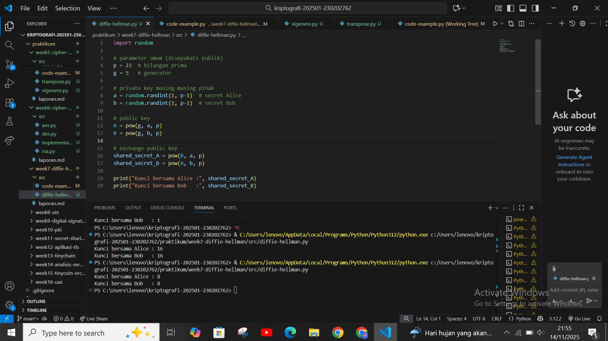
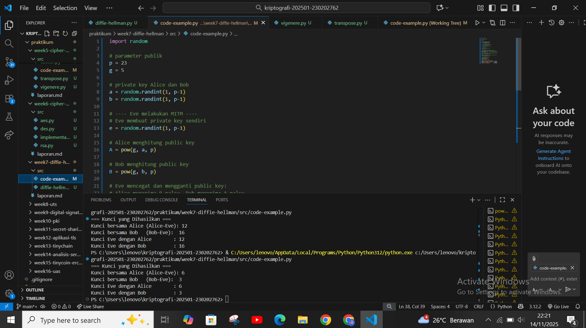

# Laporan Praktikum Kriptografi
Minggu ke-: 7 
Topik: Diffie-Hellman Key Exchange
Nama: Khusnatun Lina Fitri
NIM: 230202762 
Kelas: 5IKRB

---

## 1. Tujuan
1. Melakukan simulasi protokol **Diffie-Hellman** untuk pertukaran kunci publik.  
2. Menjelaskan mekanisme pertukaran kunci rahasia menggunakan bilangan prima dan logaritma diskrit.  
3. Menganalisis potensi serangan pada protokol Diffie-Hellman (termasuk serangan **Man-in-the-Middle / MITM**).  

---

## 2. Dasar Teori
Protokol Diffie-Hellman Key Exchange adalah salah satu metode kriptografi paling awal yang memungkinkan dua pihak untuk membangun kunci rahasia bersama melalui saluran komunikasi publik tanpa perlu mengirimkan kunci itu secara langsung. Prinsip kerja Diffie-Hellman berdasarkan pada masalah logaritma diskrit, yaitu kesulitan menghitung nilai eksponen rahasia dari hasil perpangkatan modular, sehingga kunci publik dapat diketahui dan kunci privat tetap aman.

Dalam prosesnya, kedua pihak menyepakati dua bilangan publik yaitu bilangan prima besar 𝑝 dan generator 𝑔. Masing-masing pihak akan memilih kunci privat dan menghitung kunci publiknya. Setelah saling menukar kunci publik kedua pihak akan menghitung kunci privatnya dengan menggunakan operasional modular eksponensial : gab mod p. Keamanan protokol ini terletak pada kenyataan bahwa pihak ketiga tidak dapat mengetahui kunci privat dan publik dengan mudah.

Namun Diffie-Hellman tetap memiliki kelemahan yaitu rentan terhadap Man in the middle (penyerang yang memposisikan di antara kedua pihak) dan dapat membaca atau mengubah pesan. Sehingga untuk keamanannya biasanya dilengkapi dengan autentikasi. Dalam implementasiya Diffie-Hellman sering digunakan untuk tanda tangan digital. Selain itu Diffie-Hellman juga di implementasi dalam TSL/SSL dengan menggunakan HTTPS untuk memastikan keamanan saat mengakses situs web. Dengan tambahan autentikasi, menjadikan DIffie-Hellman menjadi mekanisme ppertukaran kunci yang sangat efektif dan aman dalam komunikasi modern.

---

## 3. Alat dan Bahan
- Python 3.x  
- Visual Studio Code / editor lain  
- Git dan akun GitHub  
- Google Chrome

---

## 4. Langkah Percobaan
1. Membuat file `diffie_hellman.py` di folder `praktikum/week7-diffie-hellman/src/`.
2. Menyalin kode program dari panduan praktikum.
3. Menjalankan program dengan perintah `pythondiffie_hellman.py`.)
4. Membuat folder `screenshots` dan mengaploud file `hasil.jpg` pada folder `praktikum/week7-diffie-hellman/sreenshots/`.
5. Menjawab analisis serangan MITM.
6. Mengerjakan soal yang ada pada folder `praktikum/week7-diffie-hellman/laporan.md/`

---

## 5. Source Code

### Langkah 1:  Simulasi Diffie-Hellman

```
import random

# parameter umum (disepakati publik)
p = 23  # bilangan prima
g = 5   # generator

# private key masing-masing pihak
a = random.randint(1, p-1)  # secret Alice
b = random.randint(1, p-1)  # secret Bob

# public key
A = pow(g, a, p)
B = pow(g, b, p)

# exchange public key
shared_secret_A = pow(B, a, p)
shared_secret_B = pow(A, b, p)

print("Kunci bersama Alice :", shared_secret_A)
print("Kunci bersama Bob   :", shared_secret_B)
```
Hasilnya : 
```
Kunci bersama Alice : 13
Kunci bersama Bob   : 13
```
### Langkah 2 : Analisis Serangan MITM (Man-in-the-Middle)
```
import random

# parameter publik
p = 23
g = 5

# private key Alice dan Bob
a = random.randint(1, p-1)
b = random.randint(1, p-1)

# ---- Eve melakukan MITM ----
# Eve membuat private key sendiri
e = random.randint(1, p-1)

# Alice menghitung public key
A = pow(g, a, p)

# Bob menghitung public key
B = pow(g, b, p)

# Eve mencegat dan mengganti public key:
# Alice menerima B_palsu, Bob menerima A_palsu
A_fake = pow(g, e, p)   # public key Eve untuk Bob
B_fake = pow(g, e, p)   # public key Eve untuk Alice

# Alice menghitung shared secret (dengan kunci Eve)
shared_A = pow(B_fake, a, p)

# Bob menghitung shared secret (dengan kunci Eve)
shared_B = pow(A_fake, b, p)

# Eve menghitung dua kunci:
# kunci dengan Alice
shared_EA = pow(A, e, p)
# kunci dengan Bob
shared_EB = pow(B, e, p)

print("=== Kunci yang Dihasilkan ===")
print("Kunci bersama Alice (Alice–Eve):", shared_A)
print("Kunci bersama Bob   (Bob–Eve): ", shared_B)
print("Kunci Eve dengan Alice        :", shared_EA)
print("Kunci Eve dengan Bob          :", shared_EB)
```
Hasilnya : 
```
=== Kunci yang Dihasilkan ===
Kunci bersama Alice (Alice–Eve): 6
Kunci bersama Bob   (Bob–Eve):  1
Kunci Eve dengan Alice        : 6
Kunci Eve dengan Bob          : 1
```
Penjelasan simulasi : 

Dalam simulasi Diffie–Hellman , Alice dan Bob tidak saling mengenali identitas pihak yang mengirim public key. Hal ini dimanfaatkan Eve untuk:
1. Mencegat public key Alice dan Bob
2. Mengganti keduanya dengan public key miliknya
3. Alice menghitung kunci rahasia dengan Eve
4. Bob menghitung kunci rahasia dengan Eve
5. Eve mendapatkan:
- Kunci rahasia antara Alice ↔ Eve
- Kunci rahasia antara Bob ↔ Eve
Akibatnya:
- Alice dan Bob tidak pernah memiliki kunci yang sama
- Eve dapat membaca, mengubah, atau meneruskan pesan tanpa ketahuan
Inilah kelemahan utama Diffie–Hellman murni tanpa autentikasi.

---

## 6. Hasil dan Pembahasan

Hasil eksekusi program Diffie-Hellman :



Pembahasan :
Algoritma Diffie-Hellman berhasil menghasilkan kunci shared bersama tanpa mengirimkan kunci rahasia secara langsung. Setiap kali dijalankan, hasilnya akan selalu berbeda dikarenakan privat key dihasilkan secara acak melalui kode `a = random.randint(1, p-1)
b = random.randint(1, p-1)` , meskipun begitu selama hasil eksekusi nilai Alice dan Bob sama maka algoritma bekerja dengan benar. Jadi setiap kali Alice dan Bob memulai pertukaran kunci baru maka mereka akan selalu membuat kunci privat baru. Hal ini lah yang membuat Diffie-Hellman sangat sulit diretas karena kuncinya selalu berbeda dan akan sangat aman jika digabungkan dengan autentikasi tambahan untuk mencegah serangan Man-In-The-Middle.

Hasil Analisis Serangan MITM (Man-in-the-Middle) ;



Pembahasan :
Simulasi diatas merupakan kondisi ketika Eve mencegat pertukaran kunci antara Alice dan Bob, kemudian eve mengganti public key yang dikirim Alice ke Bob dan mengganti public key yang dikirim Bob ke Alice
Akibatnya:
- Alice tidak menghitung kunci bersama dengan Bob, tetapi dengan Eve
- Bob tidak menghitung kunci bersama dengan Alice, tetapi dengan Eve
- Eve mengetahui dua kunci berbeda, sehingga dapat membaca semua pesan

Output yang dihasilkan membuktikan bahwa serangan Man-In-The-Middle (MITM) yang dilakukan oleh Eve berhasil, karena eve dapat membuat dua jalur kunci terpisah. Selain itu Alice dan Bob juga percaya bahwa mereka saling berinteraksi satu sama lain. Inilah alasan mengapa Diffie-Hellman tanpa autentikasi rentan terhadap serangan MITM. Solusi untuk mencegah MITM yaitu dengan penggunaan tanda tangan digital dan sertifikat digital.

---

## 7. Jawaban Pertanyaan
1. Mengapa Diffie-Hellman memungkinkan pertukaran kunci di saluran publik?  
2. Apa kelemahan utama protokol Diffie-Hellman murni?  
3. Bagaimana cara mencegah serangan MITM pada protokol ini?

Jawaban : 
1. Karena Diffie-Hellman menggunakan konsep matematika berbasis logaritma diskret sehingga sulit dipecahkan. Selain itu kedua belah pihak juga hanya perlu bertukar nilai publik, sedangkan kunci privat tidak pernah dikirimkan. Jadi walaupun nilai publik dilihat oleh banyak orang, pihak lain tidak dapat menghitung kunci privat karena tidak mampu membalik operasi tersebut.

2. Kelemahan utama dalam Diffie-Hellman yaitu jika tidak dilengkapi dengan autentikasi, dimana protokol ini hanya membuat kunci bersama tanpa memverifikasi identitas pihak yang berkomunikasi. Akibatnya rentan terhadap seragan Man-In-The-Middle yaitu penyerang yang berada diantara kedua belah pihak dan membuat dua kunci terpisah tanpa ketahuan.

3. Dengan cara menambahkan proses autentikasi seperti :
   - Menggunakan sertifikat digital (TSL/SSL).
   - Tanda tangan digital (RSA).
   - Menggabungkan Diffie-Hellman dengan autentikasi berbasis password.

---

## 8. Kesimpulan
Percobaan Diffie-Hellman menunjukan bahwa dua belah pihak bisa menghasilkan kunci rahasia yang sama meskipun hanya bertukar informasi melalui kunci publik. Hal ini lah yang membuat Diffie-Hellman aman dari peyerang karena penyerag tidak bisa menghitung kunci bersama tanpa mengetahui kunci privat masing-masing pihak. Namun walaupun sudah aman algoritma ini masih rentan terhadap serangan Man-In-The-Middle (MITM) jika tidak disertai dengan proses autentikasi.

---

## 9. Daftar Pustaka

---

## 10. Commit Log

```
commit week7-diffie-hellman
Author: Khusnatun Lina Fitri <husnatunlinafitri@gmail.com>
Date:   2025-11-14

    week7-diffie-hellman: Diffie-Hellman Key Exchange
```
