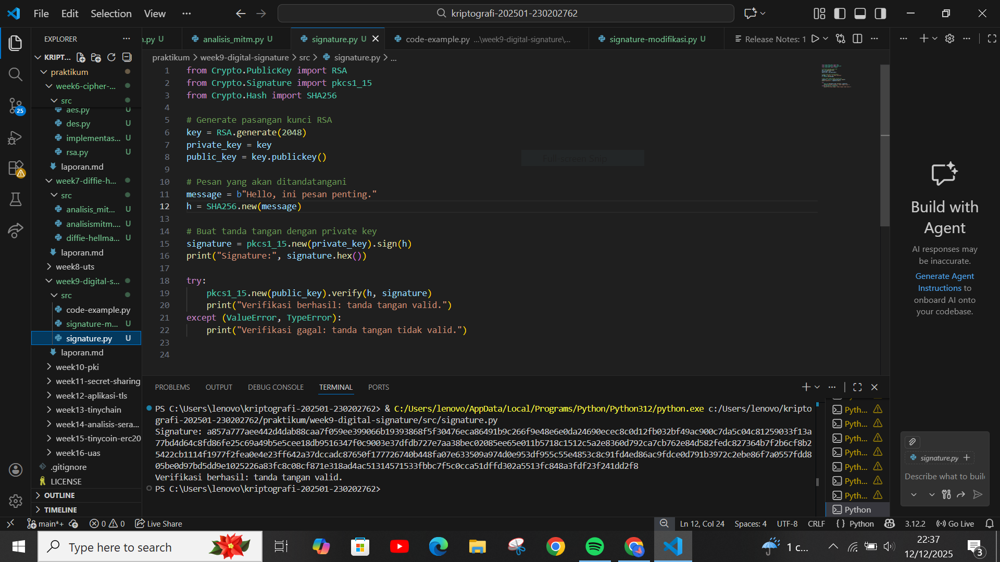
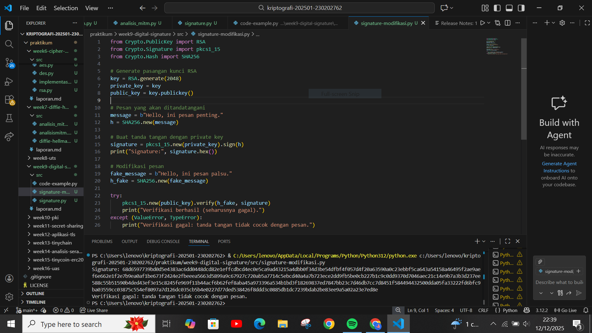

# Laporan Praktikum Kriptografi
Minggu ke-: 9
Topik: Digital Signature (RSA/DSA) 
Nama:Khusnatun Lina Fitri
NIM: 230202762
Kelas: 5IKRB

---

## 1. Tujuan
1. Mengimplementasikan tanda tangan digital menggunakan algoritma RSA/DSA.  
2. Memverifikasi keaslian tanda tangan digital.  
3. Menjelaskan manfaat tanda tangan digital dalam otentikasi pesan dan integritas data.  
---

## 2. Dasar Teori
  Tanda tangan digital dengan RSA pada dasarnya memanfaatkan konsep kriptografi kunci publik. Prosesnya dimulai dengan membuat hash dari pesan, kemudian hash tersebut ditandatangani menggunakan private key pengirim. Saat penerima mendapatkan pesan, ia cukup memverifikasi tanda tangan tersebut dengan public key pengirim dan mencocokkannya dengan hash asli. Kelebihan RSA adalah mekanismenya cukup sederhana dan sudah banyak digunakan dalam berbagai sistem keamanan.

Sementara itu, DSA (Digital Signature Algorithm) menggunakan pendekatan matematika yang berbeda, yaitu operasi logaritma diskret pada bidang bilangan modular. Algoritma ini dikenal lebih cepat dalam proses pembuatan tanda tangan, walaupun tahap verifikasinya bisa sedikit lebih lambat dibanding RSA. DSA juga sangat bergantung pada nilai acak (nonce) yang harus berbeda setiap kali menandatangani, karena jika nilai ini terulang, keamanan sistem bisa langsung terganggu.

Secara keseluruhan, baik RSA maupun DSA sama-sama dipakai untuk memastikan keaslian, integritas, serta mencegah penyangkalan terhadap suatu pesan digital. Perbedaannya terletak pada metode matematis dan performanya, tetapi keduanya tetap menjadi bagian penting dalam teknologi keamanan modern yang sering dipelajari di dunia akademik.

---

## 3. Alat dan Bahan
- Python 3.x  
- Visual Studio Code 
- Git dan akun GitHub  
- Google Chrome

---

## 4. Langkah Percobaan
1. Membuat file `signature.py` di folder `praktikum/week9-digital-signature/src/`.
2. Menyalin kode program dari panduan praktikum.
3. Menjalankan program dengan perintah `python signtaure .py`.
4. Mencoba memodifikasi program.
5. Menjawab pertanyaan
6. Membuat folder `screenshots` di folder  `praktikum/week9-digital` lalu mengaploud hasilpraktikum di dLm folder tersebut.

---

## 5. Source Code
Langkah 1 - Generate Key dan Buat Tanda Tangan
```
from Crypto.PublicKey import RSA
from Crypto.Signature import pkcs1_15
from Crypto.Hash import SHA256

# Generate pasangan kunci RSA
key = RSA.generate(2048)
private_key = key
public_key = key.publickey()

# Pesan yang akan ditandatangani
message = b"Hello, ini pesan penting."
h = SHA256.new(message)

# Buat tanda tangan dengan private key
signature = pkcs1_15.new(private_key).sign(h)
print("Signature:", signature.hex())
```
Hasilnya :
```
Signature: 443a0aee408044e7e24dd598fb7ac238e30fd8f6ce9e7263826c288bb2049d4ec54ab88a8b8081970a5f07a2257f8d5317119f4268a840084efd4693ed21eb1de27eac5340926fca2ae0276dce6b6bb060c9a6c74a7bacc1d1b45ba8d76ec6391238cdad9ee43e774c0aaddd0f5b0588f3933168adee87540dd94905b7717f9dadf6cc2825b0099bb1cc5dbdfc3800d949e8e687a35c9f41ed5a2c695f4f329a5a91892f575f169383cd32b34bb3d9cf6340b98cb36dd16b9fab4b32bb8927ebb9c1080183b6780a253fbb950be917388456f79fe7db7c8deddc544ca9beddece7c0cbd9ee332e24c4ae31b2ae057aa26ba2cd8b83739758544804047ae0ccd8
```
Langkah 2 — Verifikasi Tanda Tangan
```
try:
    pkcs1_15.new(public_key).verify(h, signature)
    print("Verifikasi berhasil: tanda tangan valid.")
except (ValueError, TypeError):
    print("Verifikasi gagal: tanda tangan tidak valid.")
```
Hasilnya :
```
Verifikasi berhasil: tanda tangan valid.
```
Langkah 3 — Uji Modifikasi Pesan
```
# Modifikasi pesan
fake_message = b"Hello, ini pesan palsu."
h_fake = SHA256.new(fake_message)

try:
    pkcs1_15.new(public_key).verify(h_fake, signature)
    print("Verifikasi berhasil (seharusnya gagal).")
except (ValueError, TypeError):
    print("Verifikasi gagal: tanda tangan tidak cocok dengan pesan.")
```
Hasilnya :
```
Verifikasi gagal: tanda tangan tidak cocok dengan pesan.
```

Signature :
```
from Crypto.PublicKey import RSA
from Crypto.Signature import pkcs1_15
from Crypto.Hash import SHA256

# Generate pasangan kunci RSA
key = RSA.generate(2048)
private_key = key
public_key = key.publickey()

# Pesan yang akan ditandatangani
message = b"Hello, ini pesan penting."
h = SHA256.new(message)

# Buat tanda tangan dengan private key
signature = pkcs1_15.new(private_key).sign(h)
print("Signature:", signature.hex())

try:
    pkcs1_15.new(public_key).verify(h, signature)
    print("Verifikasi berhasil: tanda tangan valid.")
except (ValueError, TypeError):
    print("Verifikasi gagal: tanda tangan tidak valid.")
```
Hasilnya :
```
Signature: 6bf5ea2a5dee7297c0ac6ae2c5c847bfd45194e94567f408835204499e3be947f3b6b96707e2340945b18763cdc5581b3a02085cc30e90c5425bf1f352abf65bb22a9426beb3a243685a94560705f65cd4129851fe62f28b42dcc1a39859f4c4f3121f789cd3b222de9cdf77a8dd145c1a47b7ca611e4e88be6d3b85c4078f132c25828cfc995f4274172c43b33ef4af29dbfca3c609771f5a5a06209ed6850f8ed3e5fd26fbe6842260bbe1736e5ca609a6e1840afe58e5ee3ea68572a0cd4e73904ef803dd65a4ad29882950f71678793a189387659947df7fffdfc1fed64387ffaeacc3c3eff4c6921b37dede8cdc970e5dae714876730109545ccdfc59d4
Verifikasi berhasil: tanda tangan valid.
```

Signature Modifikasi :
```
from Crypto.PublicKey import RSA
from Crypto.Signature import pkcs1_15
from Crypto.Hash import SHA256

# Generate pasangan kunci RSA
key = RSA.generate(2048)
private_key = key
public_key = key.publickey()

# Pesan yang akan ditandatangani
message = b"Hello, ini pesan penting."
h = SHA256.new(message)

# Buat tanda tangan dengan private key
signature = pkcs1_15.new(private_key).sign(h)
print("Signature:", signature.hex())

# Modifikasi pesan
fake_message = b"Hello, ini pesan palsu."
h_fake = SHA256.new(fake_message)

try:
    pkcs1_15.new(public_key).verify(h_fake, signature)
    print("Verifikasi berhasil (seharusnya gagal).")
except (ValueError, TypeError):
    print("Verifikasi gagal: tanda tangan tidak cocok dengan pesan.")
```

Hasilnya :
```
Signature: 16c9261c372ab9a0220a8f5f368394e72defe0178371e4f23b0ae1a4f1e8c1ffbfc691ecf256b8464a9a9b98883ab5e8b6ec476a67f73a5b42db77462ed40017b491ddaa23183349d17813028f736b9a47921c186e2ac174e87a6a5a4391cba23c559c23e363e3c48f8384e538d7b50c9fa5ceb1dee1c7f3e4c174b544e8aed623f92ffadd4baa4eda2e106ca2d0a266081aaa9fc8d6f569d93225b907c6065d2783ef6d54d816aae72b76d2ba492db200259a16233243926405422e06ccd0469ea623b8c12c58aebac0201e5313f60bd64f559445900a961298527407be7d5106a083070873db3c79f9858b3885027610d1ffb542edb77e33127c2d5f1aa27c
Verifikasi gagal: tanda tangan tidak cocok dengan pesan.
```

---

## 6. Hasil dan Pembahasan

Hasil eksekusi program Digital Signature dengan RSA/ DSA:





Penjelasan :

Pada praktikum ini saya mencoba membuat dan memverifikasi tanda tangan digital menggunakan RSA. Pertama, saya membuat tanda tangan dari sebuah pesan, lalu langsung saya verifikasi tanpa mengubah isi pesannya. Hasilnya, verifikasi berhasil karena tanda tangan tersebut memang sesuai dengan pesan yang saya buat di awal. Setelah itu saya coba mpodifikasi dengan mengubah isi pesannya tapi tetap menggunakan tanda tangan yang sama. Pas diverifikasi, ternyata hasilnya gagal. Dari percobaan ini saya jadi paham bahwa tanda tangan digital hanya berlaku untuk pesan asli, dan kalau pesannya diubah sedikit saja, sistem langsung mendeteksi dan menolaknya. Hal menunjukkan bahwa digital signature memang dirancang untuk menjaga keaslian dan integritas pesan.

---

## 7. Jawaban Pertanyaan
1. Apa perbedaan utama antara enkripsi RSA dan tanda tangan digital RSA?
2. Mengapa tanda tangan digital menjamin integritas dan otentikasi pesan?
3. Bagaimana peran Certificate Authority (CA) dalam sistem tanda tangan digital modern?

Jawaban : 

1. Perbedaan Utama Enkripsi RSA dan Digital Signature RSA ada pada tujuan serta arah penggunaan kunci yang berbeda:

    a. Enkripsi RSA

     - Pengirim mengenkripsi pesan menggunakan public key penerima.
       
     - Penerima membuka pesan dengan private key miliknya.
       
     - Tujuan utama: menjaga kerahasiaan pesan (confidentiality).

    b. Tanda Tangan Digital RSA
   
     - Pengirim menandatangani pesan menggunakan private key miliknya.
     
     - Penerima memverifikasi tanda tangan menggunakan public key pengirim.
       
     - Tujuan utama: menjamin keaslian (authenticity) dan integritas pesan.

2. Karena tanda tangan digital memanfaatkan hashing untuk membuat sidik jari pesan. Ketika pesan diubah sedikit saja, nilai hash akan berubah total sehingga proses verifikasi langsung gagal. Karena tanda tangan hanya dapat dibuat menggunakan private key pemiliknya, siapa pun yang memverifikasi tanda tangan dengan public key pengirim dapat memastikan:

    - Pesan tidak diubah → integrity

    - Pesan benar dari pengirim yang sah → authenticity

3. Peran Certificate Authority (CA) dalam sistem digital signature adalah sebagai pihak ketiga yang berfungsi untuk:

    - Memverifikasi identitas pemilik kunci publik

    - Menerbitkan digital certificate yang menghubungkan identitas seseorang/organisasi dengan public key

    - Menjadi dasar trust dalam sistem keamanan modern seperti HTTPS, email secure, dan dokumen bertanda tangan digital

    Dengan CA, pengguna tidak perlu ragu terhadap keaslian sebuah public key, sehingga sistem tanda tangan digital dapat berjalan dengan aman dan dapat dipercaya.
---

## 8. Kesimpulan
Dari praktikum ini saya menyimpulkan bahwa tanda tangan digital hanya akan valid jika pesan yang diverifikasi sama persis dengan pesan saat tanda tangan dibuat. Ketika pesan diubah sedikit saja, proses verifikasi langsung gagal karena hash-nya sudah berbeda. Hal ini menunjukkan bahwa digital signature sangat efektif dalam menjaga keaslian, integritas, dan keamanan data yang dikirimkan.

---

## 9. Daftar Pustaka 

---

## 10. Commit Log

```
commit week9-digital-signature
Author: Khusnatun Lina Fitri <husnatunlinafitri@gmail.com>
Date:   2025-11-08

  week9-digital-signature: implementasi Caesar Cipher dan laporan )
```
